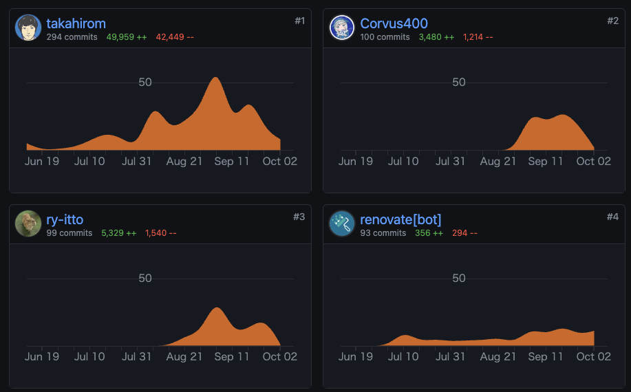

<!-- ---
stylesheet: https://cdnjs.cloudflare.com/ajax/libs/github-markdown-css/2.10.0/github-markdown.min.css
body_class: markdown-body
css: |-
  .page-break { page-break-after: always; }
  .markdown-body { font-size: 11px; }
  .markdown-body pre > code { white-space: pre-wrap; }
--- -->

# 職務経歴書

- この職務経歴書はこちらに最新版があります: https://github.com/Corvus400/resume

## プラットフォームやフレームワークの経験歴

|      名称      | 経験歴        |
|:---------------|:-----------|
| Android Mobile | 5年半(68ヶ月)  |
| Android TV     | 6ヶ月        |
| iOS            | 6ヶ月        |
| Flutter        | 2ヶ月        |
| Cocos2d-x      | 1.5年(18ヶ月) |

## 言語の経験歴

|     名称    | 経験歴                          |
|:------------|:-----------------------------|
| Kotlin      | 4年強(56ヶ月)                    |
| Swift       | 6ヶ月                          |
| Dart        | 2ヶ月                          |
| C++         | 1.5年(18ヶ月)                   |
| Java        | 3年(35ヶ月)                     |
| JavaScript  | (業務でのモック修正や個人的な趣味で)6ヶ月相当     |
| Objective-C | (Cocos2d-xのネイティブ連携記述時で)1ヶ月相当 |
| Python      | (大学在学中)3ヶ月相当                 |
| PHP         | (大学在学中)3ヶ月相当                 |
| C           | (C++学習前のキャッチアップとして)1ヶ月相当     |
| RPG3        | (新卒企業で)5ヶ月                   |

## 業務外活動

<!-- 

DroidKaigi2023コントリビュート
 -->

DroidKaigi2023コントリビュート :+1: 

- 8/14のリポジトリ公開から9/13までの30日間コントリビュートしました
- 結果と貢献を通じて何を学んだかは[Zenn](https://zenn.dev/todayama_r/articles/404e358eaac1f1)に纏めておりますのでそちらをご覧ください
- 今年も前年同様[Welcome Talkにてオーガナイザーの方々と並ぶ形でご紹介頂きました](https://x.com/Todayama_R/status/1702496851340193816?s=20)
- 今年は去年より貢献順位が一つ上がり[Takahiromさんに並ぶ二位の位置を占めることが出来ました](https://twitter.com/Todayama_R/status/1702496604190847010)

<!-- 

DroidKaigi2022コントリビュート
 -->

DroidKaigi2022コントリビュート :+1: 

- 9/6のリポジトリ公開から10/2までの26日間で[大小様々なPRを38個](https://github.com/DroidKaigi/conference-app-2022/pulls?q=is%3Apr+author%3ACorvus400+)作成
  - その内2個にリポジトリオーナーの[takahirom](https://github.com/takahirom)さんより[awesomeタグ](https://github.com/DroidKaigi/conference-app-2022/pulls?q=is%3Apr+author%3ACorvus400+is%3Aclosed+label%3Aawesome)を頂きました
- [Issueも16個消化し内5個がhigh priorityのもの](https://github.com/DroidKaigi/conference-app-2022/issues?q=is%3Aissue+assignee%3ACorvus400)でした
- [DroidKaigi2022 Day1 の Welcome Talk　にてオーガナイザーの方々と並ぶ形でご紹介頂きました](https://www.youtube.com/watch?v=P8BZw_yCokc&t=5327s)

<!-- 

Flutter学習
 -->

Flutter学習

- [Flutter for Android developers](https://docs.flutter.dev/get-started/flutter-for/android-devs), [Flutter Layout Cheat Sheet](https://medium.com/flutter-community/flutter-layout-cheat-sheet-5363348d037e), [Flutter Gallery](https://gallery.flutter.dev/#/) の内容を踏まえて学習
  - https://github.com/Corvus400/my-flutter-cook-book-animation-app
  - https://github.com/Corvus400/my-flutter-for-android-developers-app
  - https://github.com/Corvus400/my_flutter_layout_cheat_seat_app
  - https://github.com/Corvus400/my_flutter_animation_tutorial_app
  - https://github.com/Corvus400/my-flutter-cook-book-effects-app

<!-- 

Android Developers の翻訳動画を作成
 -->

Android Developers の翻訳動画を作成

- 参画先のキャッチアップ時間で話題として提供 https://zenn.dev/todayama_r

## 携わったプロジェクト

> **Note**
> 各プロジェクトをクリックすると詳細が展開されます

<!-- 

2022年12月 - 2023年8月 / BtoC / REALITY株式会社(グリーグループ) / REALITYのAndroidアプリ開発・保守 :+1: 
 -->

2022年12月 - 2023年8月 / BtoC / REALITY株式会社(グリーグループ) / REALITYのAndroidアプリ開発・保守 :+1: 

# 触れた技術スタック

- Kotlin, Jetpack Compose, Android, Protocol Buffers, RESTAPI, Kotlin Coroutine, MVVM, LiveData, flow, koin, Lokalise

# 概要
- ストアURLは此方( https://play.google.com/store/apps/details?id=net.wrightflyer.le.reality&hl=ja&gl=US&pli=1 )
- マルチモジュール構成を取っておりfeature/libraries/data/coreから成る
- UaaL( Unity as a Library )を採用しておりUnityを使用してアバターの表示を行いUnityの上にネイティブのUIを表示する構造となっている
- 12言語対応のためLokaliseというサービスを使用しstrings.xmlは手動ではなくサービスから出力されたものを使用する形となっている
- 通信クライアント部分が別リポジトリで管理されており部分的にProtocol Buffersを使用
- 新機能開発の合間に整理されていない状態となっていたドキュメントの整理などチーム全体の効率を上げるタスクも自ら実行

# 担当
- REALITY Androidアプリの新機能開発・保守を主に実施
- チーム人数は10人

# 課題
- 他社ではチャットへの流入を増やすためのシェア導線が準備されているがREALITYではアプリ外シェアがメインとなっており流入が少ない状態となっていた
- デフォルトで通知がONになっておりフォロー通知が頻繁に飛ぶため通知をOFFにされるケースが多い状態となっていた　加えて通知をOFFにするとONに戻すきっかけが存在していない
- Plural機能が使用されていないため単位の単数複数形が存在する言語の翻訳品質が低下していた
- GitHubのWikiに情報が集積されているものの整理されておらず必要な情報に辿り着くことが難しい状態となっていた

# 取り組み
- JetpackComposeによる画面の作成・REST APIの追加を実施
- JetpackComposeではpluralStringResourceを使用しXMLではgetQuantityStringを使用する事でLokaliseから出力されるリソースを表示出来るようにした
- チーム内にて協議しプロジェクト内にDocsフォルダを作成しWikiとDocsの役割分担を行い整理を実施

# 工夫した点
- DroidKaigi2022での貢献を通して得た知見を活用した

<!-- 

2022年01月 - 2022年06月 / BtoC / 新規動画配信サービスアプリ開発 :+1: 
 -->

2022年01月 - 2022年06月 / BtoC / 合同会社DMM.com / 動画配信サービスアプリ開発 :+1: 

# 触れた技術スタック

- Android TV, Kotlin, GraphQL, Apollo Client, Kotlin CoroutineKotlin Multiplatform Mobile, ExoPlayer, LiveData, Kotlin Flow, Koin, MVVM, DDD, Mermaid, PlantUML, JavaScript, Node.js

# 概要
- 動画配信サービスアプリを置き換えるためのAndroid TV開発
- Kotlin Multiplatform Mobile(KMM)を利用したマルチモジュール/マルチフレームワーク構成
- GraphQL(BFF)のQueryとMutation部分も設計・実装
- 各種スキーマの定義も実施
- 設計の際にはMermaidやPlantUMLを使用してクラス図を作成しレビュー
- 主体的に自チームだけでなく各チームと仕様や実装についてやり取りを行い自走しタスクを進めた
- Android知識のキャッチアップを行う時間が業務中に有りその時間の為に [Android Developers の翻訳動画を作成](https://zenn.dev/todayama_r)するなどした
- 5/17時点で 対応画面数は10以上 UseCase類の設計も10以上 作成したPRは111個 コードは 20,290++ 9,208-- 1,191貢献

# 担当
- 17人チームのAndroid TV側を担当
- 基本設計・詳細設計・実装・単体テストを実施

# 課題 
- Android TV側にはNavigationコンポーネントが導入されておらずMainActivityのFragmentを各開発者がreplaceして遷移させる処理を各所に書いていた
  - 一ヵ月も絶たない内に遷移処理が複雑化しバグの温床になるのが目に見えていた
- Android TVはMobile開発では意識する必要のないフォーカス制御が肝であるが開発当初はチーム全員がフォーカス制御が上手く出来ず開発速度が停滞した
- GraphQLの知識が0のメンバーが殆どで有りダミーデータの直書きからQueryやMutationを実行するよう置き換える際にも開発速度が停滞した
- KMMのためiOS,Android Mobile, Android TV総勢30名以上がソースに触れる為CI(Bitrise)チェックをすり抜けてdevelopのビルドが通らない状態になる事が頻発した
- 既存サービスが有るとはいえ新規の大規模開発のためリードエンジニアだけでは対応が追い付かない部分が多々有り日々いくつもの問題が発生していた

# 取り組み 
- KoinのSharedViewModelと遷移先を判定するためのsealed interfaceを用意し各実装者がバラバラに記述していた遷移処理を統一させた
- Android TV特有のライブラリであるLeanbackのキャッチアップをチーム全体で行いフォーカス制御が上手く出来ないRecyclerViewの代わりにRowsSupportFragmentを使用するなどして開発速度の停滞を防いだ
- 自分が[参画前にキャッチアップしていたGraphQLの知識](https://github.com/Corvus400/my-server-for-graphql-learning)を基に他メンバーの実装を助ける等して開発速度の停滞を防いだ
- PRマージ後にローカルでビルド出来るかをこまめにチェックする等して対応
  - BitriseのプランをTeamsより上のVelocityプランへ引き上げるとTeamsへ戻す際に手続きに時間がかかるため
  - 最新developを取り込み必須にする設定にも出来たが頻繁にdevelopへPRがマージされる状況ではいつ迄経ってもマージできない状況になり開発速度が低下する為上記の対応
- GraphQLのモックサーバがNodemonで自動再起動されるようになっていたがindex.jsと同じディレクトリのJSファイルのみ監視しており.graphqlファイルの変更が監視されていなかった
  - そのため監視されるようにpackage.jsonを修正する対応を実施
- GraphQLにてカスタムスカラーが定義されていたもののモックされていなかった為参照されるとResolve出来ずクラッシュしていた
  - カスタムスカラーをモックするように定義を修正する対応を実施
- 他にもドキュメント(Markdown)を適宜修正するPRを出し全体周知する対応を実施する等割り当てられたタスク以外の球拾いタスクも適宜実行し対応

# 工夫した点 
- 自チームだけでなく他チームなど全体を見て重複作業の発生防止や困っている点を把握対応し個ではなくチームとしての開発速度を底上げできるよう努めた
- レビューを行う必要があるPRが毎日最低5件以上は出ており他のメンバーの作業をブロックしない為に時間を決めて全てレビューするよう務めた
- 参画前から[GraphQL](https://github.com/Corvus400/my-server-for-graphql-learning)やJetpack ComposeをUdemyの動画を購入して翻訳して見ながら実装をしてみる等してキャッチアップしていた

<!-- 

2021年06月 - 2021年12月 / BtoC / 歩数計シリーズアプリ開発 :+1: 
 -->

2021年06月 - 2021年12月 / BtoC / メドピア株式会社 / 歩数計シリーズアプリ開発 :+1: 

# 触れた技術スタック

- Android Mobile, Kotlin, LiveData, Room, Dagger, Kotlin Coroutines, Kotlin Flow, DataBinding, Realm, Flipper, OneSignal

# 概要
- 歩数計シリーズアプリ開発(Android)
- 3つの歩数計アプリをそれぞれ担当
- 新規機能追加が主
- マルチモジュール・AAC（LiveData、ViewModel、Room）・Dagger採用の歩数計テンプレートアプリをsubtreeで取り込み各プロダクトに応じたカスタマイズを行うタイプとシングルモジュール・MVPのアプリそれぞれを担当
- フルリモートにて対応

# 担当
- 7人～14人チームのAndroid側を担当
- 実装・単体テスト・結合テスト・保守・運用を実施

# 課題
- テンプレートアプリ側でDeprecated等の警告が多数出ておりGitHubでのレビュー時にbotが警告を大量に出力していたのでそれを無くす必要が有る
  - 具体的には NetworkInfo(Deprecated)・FragmentPagerAdapter(Deprecated)・startActivityForResult(Deprecated)・onActivityResult(Deprecated)・requestPermissions(Deprecated)・kotlinx.coroutines.ExperimentalCoroutinesApi(experimental)・name shadowed・unnecessary safe call(Kotlinバージョンアップに伴う引数のnon-null変更)・type mismatch・whenのcase不足・never used・no cast needed・Interfaceと実装での引数名前違い
- 新規開発のテンプレートを使用したアプリではテンプレートアプリには無い歩数を示すマーク代わりの動物の画像をアニメーションさせる機能を追加する必要が有った
- 何れのアプリもPM側が余り仕様を把握していない状態の為言葉通りにタスクを進めるのは危うい状態
- 課金機能の実装と動作確認を行う要件への対応

# 取り組み
- 地道に警告文が出ている部分を一つ一つデグレしていないか確認しながら解消
- 先に参画している開発者にアドバイスを貰いつつ他のテンプレートアプリを使用していないアプリ側の処理を参考に実装
- SlackやBacklogや昼会で口頭確認して仕様の不整合や不明点を潰しながらあやふやな部分の仕様を明確化
- テンプレートアプリが実装済みの課金機能を使用して要件を満たす

# 工夫した点
- レビューは余り細かく見るプロジェクトでは無かったがレビュー負担を減らすのと見逃しを減らす為に説明を加えた方が良いと思った箇所にGitHub上でシングルコメントを各所に追記した状態でPRを出していた
- 既存のテンプレートアプリの出来が良いので独自色を出すのは控え可能な限りテンプレートアプリの処理を参考にして機能追加や改修を行う事で作業時間を極限まで短縮した

<!-- 

2020年10月 - 2021年03月 / BtoBtoC / お薬手帳アプリ開発
 -->

2020年10月 - 2021年03月 / BtoBtoC / 株式会社くすりの窓口 / お薬手帳アプリ開発

# 概要

- お薬手帳機能他血圧手帳等複合機能アプリ開発(BtoBtoC)
- Crashlyticsに記録された不具合の改修対応等が主。

# 担当
- 6人チームのAndroid側を担当
- 実装・単体テスト・結合テストを実施

<!-- 

2020年04月 - 2020年06月 / CtoC / 旅行口コミアプリ開発 :+1: 
 -->

2020年04月 - 2020年06月 / CtoC / 株式会社インタースペース / 旅行口コミアプリ開発 :+1: 

# 触れた技術スタック

- Android Mobile, Kotlin, iOS, Swift, Redux, DDD, Navigator, Spek2, MockK, Mockito, Adjust, Repro, Crashlytics, DataBinding

# 概要
- 旅行先の口コミ掲載アプリ開発
- Redux・DDDのコンビネーション構成に沿って機能追加を担当
- アーキテクチャーはRobert C. MartinのClean Architectureを参考としたものを採用
- 画面の追加はNavigationコンポーネントにより実装(1Activity多Fragment)
- テスト(Spek2)の追加も機能追加と同時に実施
- app,ui,domain,infrastructureからなるマルチモジュール構造
- フルリモートにて対応

# 担当
- 5人チームのAndroid側を担当
- 実装・単体テスト・結合テストを実施

# 課題
- iOSで先行してリリースされている自社サービスアプリをAndroidでも展開する事が目的
- PMが仕様を余り把握しておらずドキュメントもあてにならない状態の為先にリリースされているiOS側のコードを見て実装を進める流れになっていた
- 実現したい内容に比して複雑なアーキテクチャーを採用している為新規機能追加や改修のスピードが落ちていた

# 取り組み
- Swiftコードを読み解きiOS側のアプリの動作を見ながら仕様の不明点を解消して実装を進めた
- キャッチアップが足りていない点を補いつつ実装を進めた

# 工夫した点
- 業務時間外でもキャッチアップを積極的に行った

<!-- 

2019年07月 - 2020年03月 / BtoCtoC / 人材系アプリ開発 :+1: 
 -->

2019年07月 - 2020年03月 / BtoCtoC / 株式会社リブセンス / 人材系アプリ開発 :+1: 

# 触れた技術スタック

- Android Mobile, Kotlin, Java, RxJava, DbFlow, Room, iOS, Swift, Adjust, Repro

# 概要
- 成功報酬型人材紹介アプリ開発
- アーキテクチャーはRobert C. MartinのClean Architectureを参考としたものを採用
- 機能追加・改修・ABテスト対応を実施
- RxJava1系から2系への移行とKotlin化対応も施策対応と並行して実施
- DbFlowからRoomへのマイグレーション対応も一部実施
- 正社員の方とのディスカッションに参加し要件定義部分から関わる開発スタイル
- 正社員の方と同様10%ルールに参加しiOSアプリ側の簡単な改修も行う
- 当初は出社での業務で後半よりフルリモートにて対応
- 9ヶ月で作成したPRは凡そ90個 コードは 974コミット 52,377++ 31,415-- 1,434貢献

# 担当
- 7人チームのAndroid側を担当
- 実装・単体テスト・結合テスト・保守・運用を実施

# 課題 
- Java部分が多くRxJava1やDbFlow等が使用されている部分が多くグロースに繋がり辛い部分の近代化改修が遅遅として進んでいない状態だった
- スピーディーにABテスト対応を行いグロースさせる事が非常に重視される現場だった為余日管理が他の案件より高度な物を要求された
- レビュー時にもパフォーマンスやコードの分かりやすさを非常に厳密に求められた

# 取り組み 
- 新規追加分のコードはKotlinで書き既存部分の改修やABテスト対応時についでにKotlin化や陳腐化したライブラリの入れ替えを実施
- 余日精度を上げるためにどのタスクにどの位の時間を費やしたかを日単位ではなく時間単位で毎日記録
- 可能な限り過去のレビュー指摘事項と同じ指摘事項が付かないようPRを出す前に過去のPRの指摘事項を確認してからレビューを依頼

# 工夫した点 
- PM等が会議に多く時間を取られるため仕様策定や確認に時間を多く割ける環境では無かった
  - ツーカーで済むコミュニケーションとなるように仕様の不明点を5W1Hを徹底して箇条書きにして短い文章となるようにして伝えるよう特に気を配った
- どの位の時間で終わるか不透明な部分から重点的に見積もりするようにした
- 時間が限られているので特に指摘回数が多い指摘事項については個人用SlackにメモしてPRを出す前に確認するようにした

<!-- 

2019年04月 - 2019年06月 / BtoB / タクシー乗務員業務用アプリ開発 :+1: 
 -->

2019年04月 - 2019年06月 / BtoB / 株式会社Mobility Technologies(旧JapanTaxi株式会社) / タクシー乗務員業務用アプリ開発 :+1: 

# 触れた技術スタック

- Android Mobile, Kotlin, DeviceOwner, ExoPlayer, AudioFocus, Service, Kotlin Coroutine, Timber, Kibana, Espresso

# 概要
- MaaS大手(現在は合併社名変更)の乗務員用アプリ開発
- Android側を担当
- DeviceOwner使用端末のOreo,Pie対応、Espressoテスト項目追加、ラジオ機能追加等(ExoPlayerやAudioFocusやService使用)
- IPタブレット(旧システム)・広告タブレット(乗客側に設置 広告掲示と料金決済等に使用)・乗務員タブレット(ナビゲーションや乗車前の乗客との連絡用 タブレットによってPh1,Ph2がそれぞれ存在)と機器が複数存在
- 出社での業務

# 担当
- 上記機器の内乗務員タブレットに使用するアプリ7人チームのAndroid開発を担当
- 実装・単体テスト・結合テストを実施

# 課題
- 乗務員が非常時にのみ使用する事を想定したラジオ機能を追加する必要が有る
  - ラジオ機能を使用している間もナビゲーションや乗客からの通話がかかってくる事が有るためAudioFocusによる制御は必須
- 新規決済手段を追加する必要が有る
  - 広告タブレットチーム側と連携する必要が有る
- DeviceOwnerを使用するアプリの為端末の更新に伴いAndroid9.0に対応する必要が有る
  - 単純にminSdkVersionを上げるだけではクラッシュして起動すらしないので起動するようにまず修正しそこから各機能が9.0更新前と同じ見た目で動くようにする必要が有る
    - 具体的には Apache HTTP対応・ManifestでのReceiver登録からregisterReceiverする方法への変更・network-security-configの設定など

# 取り組み
- 正社員の方より展開された正社員の方製のラジオアプリを参考にしてラジオ機能を追加した
- Android9.0更新時には地道に一つ一つ機能を手動で確認し表示崩れや機能が正常に動作するかの確認を目視とログ上で確認しながら改修
- 各機能の追加時に必要に応じてespressoテストを追加

# 工夫した点
- 正社員の方がミーティングや話し合いなどで拘束されている時間が長い為ツーカーで済むコミュニケーションとなるように仕様の不明点を5W1Hを徹底して箇条書きにして短い文章となるようにして伝えるよう特に気を配った

<!-- 

2018年12月 - 2019年03月 / BtoC / 仮想通貨クライアントアプリ開発
 -->

2018年12月 - 2019年03月 / BtoC / 仮想通貨クライアントアプリ開発

# 概要

- BtoC向けの仮想通貨クライアントアプリ開発。

# 担当
- 5人チームのAndroid側を担当
- 実装・単体テストを実施

<!-- 

2018年04月 - 2018年05月 / BtoB / ローカル仮想通貨アプリ開発
 -->

2018年04月 - 2018年05月 / BtoB / ローカル仮想通貨アプリ開発

# 概要

- BtoB向けの仮想通貨クライアントアプリ開発。

# 担当
- 5人チームのAndroid側を担当
- 詳細設計・実装・単体テストを実施

<!-- 

2017年11月 - 2018年03月 / BtoC / 化学メーカーのHEMSアプリ開発 :+1: 
 -->

2017年11月 - 2018年03月 / BtoC / 化学メーカーのHEMSアプリ開発 :+1: 

# 概要
- Home Energy Management Systemアプリ開発
- フルスクラッチの為要件定義から実装迄を担当
- Android側の開発アドバイス、開発手法・ツール提案等も実施
- アーキテクチャはMVC
- 出社での業務

# 触れた技術スタック

- iOS, Swift, Carthage, Android Mobile, Kotlin, Bluetooth

# 担当
- 1-4人チームのiOS側を担当
- 詳細設計・実装・単体テストを実施

# 課題
- ECHONET Lite規格に沿って蓄電池や太陽光パネルと通信し通信によって得た値をグラフ等で表示する

# 取り組み
- どのようなアーキテクチャにするか、ライブラリの選定、READMEへの使用ライブラリやアーキテクチャを記載
- 要件定義を行いつつ一人でプロジェクトに従事
  - その後追加された人員も未経験者の為自身が後から来た人員に対して知見を共有
- Android側はフルKotlinだったがAndroid開発未経験者とJavaでのAndroid開発のみ経験が有る人員だった為Kotlinでの開発の知見や開発手法・ツール提案などを実施し作業効率の向上を図った

# 工夫した点
- iOS開発自体が知識経験がほぼゼロの状態なので業務時間外でもキャッチアップを行い不利を補った
  - Bluetooth通信については iOS×BLE Core Bluetoothプログラミング を参考に実装

<!-- 

2017年06月 - 2017年11月 / BtoC / 空調機・化学製品メーカーの製品用リモコンアプリ開発 :+1: 
 -->

2017年06月 - 2017年11月 / BtoC / 空調機・化学製品メーカーの製品用リモコンアプリ開発 :+1: 

# 触れた技術スタック

- Android Mobile, Java, Glide

# 概要
- 大手空調機・化学製品メーカーのエアコン・空気清浄機のリモコン(宅内・宅外)アプリ開発のAndroid側を担当
- 開発体制の改善提案等も実施
- 出社での業務

# 担当
- 6人チームのAndroid側を担当
- 基本設計・詳細設計・実装・単体テストを実施

# 課題
- 空調製品を操作するアプリの機能追加・改修を行う

# 取り組み
- メーカー側のブランドキャラクターのAnimation GIFを読み込み動作させる
  - Androidのアニメーション機能を用いてアニメーションさせていないので途中で動作を止める等の細かい制御が簡単に出来ず実装が難航
- 屋外からの空調機器操作を行う機能を追加する
  - LANに接続された空調製品とアプリを仲立ちする機器が有りそちらと連携する事で温度・湿度の取得や運転モードの設定を空調製品に伝達する機能
  - 当時の法律では屋外からの家電操作が厳しく制限されていたため法律に配慮した実装となり仕様が難解になり実装が難航
- 新しい運転モードへの対応

# 工夫した点
- 正社員同様業務委託メンバーも顧客と仕様調整を行うミーティングに参加するよう求められていたので積極的により実装が簡単になるよう働きかけた
- 他のメンバーの誰一人としてレビューをする意味を理解しておらず相互レビューではあったが仕様不備指摘や実装改善提案などをレビューでしていない状態だった
  - リーダブルコードを基にしながらレビューで他メンバーにどのようにレビューをするかを示した
- ECサイトアプリ開発の時と同様テスト項目書を作成する事を求められたのでテスト観点表を作成してそれを基にしてテスト項目書を作成する流れになるよう働きかけた
- Gitのコミットメッセージやコメントもコードを日本語で説明するような役に立たない状態だったのでコードには How コミットログには Why コードコメントには Why not を書く形にするようレビューを中心として働きかけた
  - メソッド名も同様

<!-- 

2017年02月 - 2017年05月 / BtoB / 配送事業者のアプリ開発
 -->

2017年02月 - 2017年05月 / BtoB / 配送事業者のアプリ開発

# 概要

- 大手配送事業者の次世代業務端末機の開発。

# 担当
- 10人チームのAndroid側を担当
- 詳細設計・実装・単体テスト・結合テストを実施

<!-- 

2016年06月 - 2017年01月 / BtoC / ECサイトアプリ開発 :+1: 
 -->

2016年06月 - 2017年01月 / BtoC / ECサイトアプリ開発 :+1: 

# 概要
- 大手コンビニ事業者が、複数アプリで提供していたサービスを統合する事を目的とするアプリの開発
- 出社での業務

# 担当
- 6人チームのAndroid側を担当
- 基本設計・詳細設計・実装・単体テスト・結合テストを実施

# 課題
- 多数ある自社ブランドを一つのアプリで提供する事を目的とするアプリの機能追加や改修を行う

# 取り組み
- Nativeのログイン画面をWebViewに置き換える
  - 通常は逆だがコンビニ事業者側よりログイン画面のデザイン都合でWebView化を行う事となった
  - DOMをJavaScriptで細かく制御する必要が有るがこの時期のAndroid端末はOSバージョンや端末によってWebViewの動作が一様でない為最後までこの部分の実装で難航する事になる
- Excelで基本設計書・詳細設計書・テスト仕様書を作成する事を求められる為実装前にそれらのドキュメントレビューを行い実装を行う流れ
  - ウォーターフォールだが設計書のレビューが通った後に実装を進めると実現出来ないケースや想定通りに動作しない事が判明するケースが多く設計書を修正しながら実装をする事が多かった
  - テスト仕様書についてはテスト仕様書そのものをレビューすると項目自体が多すぎてレビュー漏れが多発した為後半からはテスト観点表をレビューしそれを基にテスト項目書を作成し手動テストを行う流れとなった
- 一つ一つの実装にログ出力とコメントを書く事が求められた為要望に沿って実装
  - コメントが実装と乖離したり間違っている事も多いが保守されず放置されている
  - 使用されていないクラスの削除も認められない為不要なコードが多数残ったまま放置されている

# 工夫した点
- プロジェクト体制や人員に多くの問題を抱える中で周りの先に参画しているエンジニアに仕様やコーディングについての助言を積極的に請う事で作業時間の短縮を図った

<!-- 

2016年03月 - 2016年06月 / BtoC / 適正診断アプリ開発
 -->

2016年03月 - 2016年06月 / BtoC / 株式会社ハコブネ / 適正診断アプリ開発

# 概要

- 職業適性を診断するアプリの開発の端末側を一人で担当。
- 企画内容に基づいて開発。
- Cocos2d-x使用。

# 担当
- 要件定義・基本設計・詳細設計・実装・単体テスト・結合テスト・総合テスト・保守・運用を実施

<!-- 

2016年02月 - 2016年03月 / BtoB / Androidビーコンアプリ開発
 -->

2016年02月 - 2016年03月 / BtoB / 株式会社ハコブネ / Androidビーコンアプリ開発

# 概要

- バスの通行状態を検知するビーコンアプリの開発の端末側を一人で担当。

# 担当
- 要件定義・基本設計・詳細設計・実装・単体テスト・結合テスト・総合テスト・保守・運用を実施

<!-- 

2016年01月 - 2016年02月 / BtoC / プログラミング教育講師・チューター
 -->

2016年01月 - 2016年02月 / BtoC / 株式会社ハコブネ / プログラミング教育講師・チューター

# 概要

- 子供向けにプログラミング授業を中学校や学習塾などへ提供。講師の育成など。
- Scratchを使用。

<!-- 

2015年11月 - 2016年05月 / BtoC / 遺言動画保存アプリ開発
 -->

2015年11月 - 2016年05月 / BtoC / 株式会社ハコブネ / 遺言動画保存アプリ開発

# 概要

- 遺言動画を撮影・保存するアプリの開発の端末側を一人で担当。
- 企画内容に基づいて開発。

# 担当
- 要件定義・基本設計・詳細設計・実装・単体テスト・結合テスト・総合テスト・保守・運用を実施

<!-- 

2015年02月 - 2015年03月 / BtoB / 新入社員向けプログラミング講義教師
 -->

2015年02月 - 2015年03月 / BtoB / 株式会社ハコブネ / 新入社員向けプログラミング講義教師

# 概要

- 他社の新人教育要員として参画。
- Scratchを使用。

<!-- 

2015年01月 - 2016年02月 / BtoC / 育成シュミレーションアプリ開発 :+1: 
 -->

2015年01月 - 2016年02月 / BtoC / 株式会社ハコブネ / 育成シュミレーションアプリ開発 :+1: 

# 触れた技術スタック

- Cocos2d-x, Android Mobile, iOS, C++, Java, Objective-C, ニフクラ mobile backend

# 概要
- 自社開発の昆虫育成シュミレーションアプリを企画・開発
- 台湾ベンダーとの共同事業。Cocos2d-x使用
- 10月のリリース後はアップデートや保守等を一人で実施
- 出社での業務

# 担当
- 1-4人チームの実装を担当
- 要件定義・基本設計・詳細設計・実装・単体テスト・結合テスト・総合テスト・保守・運用を実施

# 課題
- 受託開発メインの会社だったが自社プロダクトを持つために協業している台湾の会社と協力しゲームアプリを作成する

# 取り組み
- Cocos2d-xを使用する事でAndroid・iOSそれぞれでゲームアプリを提供する
  - Cocos2d-xのバージョンアップが頻繁に有り公式のバージョンアップコマンドを単純に実行すると失敗しビルドが出来なくなる事が多い等決して使い勝手の良いフレームワークでは無かった
  - Cocos Studio を当初使用して開発していたため保守の段階で Cocos Creator になった際にデータに互換性が無く保守が難航
- C++コードからは呼び出せない各OS依存の処理(SNSへの投稿でIntentを使用する等)はJNI等を使用してネイティブ連携
- 自社のデザイナープランナーと台湾ベンダーのデザイナープランナープログラマーと協力し企画から実装・テストまで全部担当
  - 台湾ベンダー側のプログラマーのコード品質が低すぎたため途中から外れて頂きその部分も自分で巻き取り
- アプリのimpressionの効果測定の為のライブラリ導入(C++ではなくJavaとObjective-Cでそれぞれ導入)
- PUSH通知を行うためにニフクラ mobile backendを導入
  - 公式ドキュメント通りに導入しようとすると上手くいかなかった為導入が難航

# 工夫した点
- 業務時間外でのキャッチアップ
- 入れ替わりで辞めていった正社員の方が在籍している間に可能な限り知見の共有を行ってもらう事で知識・経験不足を補った

