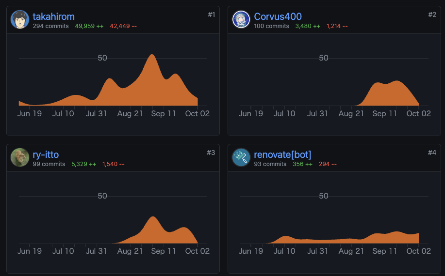

<!-- ---
stylesheet: https://cdnjs.cloudflare.com/ajax/libs/github-markdown-css/2.10.0/github-markdown.min.css
body_class: markdown-body
css: |-
  .page-break { page-break-after: always; }
  .markdown-body { font-size: 11px; }
  .markdown-body pre > code { white-space: pre-wrap; }
--- -->

# 職務経歴書

- この職務経歴書はこちらに最新版があります: https://github.com/Corvus400/resume

## プラットフォームやフレームワークの経験歴

|      名称      | 経験歴        |
|:---------------|:-----------|
| Android Mobile | 8年(96ヶ月)  |
| Android TV     | 6ヶ月        |
| iOS            | 8ヶ月        |
| Flutter        | 4ヶ月        |
| Cocos2d-x      | 1.5年(18ヶ月) |

## AI活用歴(ChatGPTなどは割愛)

|      名称      | 経験歴        |
|:---------------|:-----------|
| Claude Code | 9ヶ月 |
| GitHub Copilot CLI | 2ヶ月 |
| Devin | 2ヶ月 |
| Codex | 2ヶ月 |
| Claude Design | 1ヶ月 |

## 言語の経験歴

|     名称    | 経験歴                          |
|:------------|:-----------------------------|
| Kotlin      | 7年(86ヶ月)                    |
| Swift       | 8ヶ月                          |
| Dart        | 4ヶ月                          |
| C++         | 1.5年(18ヶ月)                   |
| Java        | 3年(35ヶ月)                     |
| JavaScript  | (業務でのモック修正や個人的な趣味で)6ヶ月相当     |
| Objective-C | (Cocos2d-xのネイティブ連携記述時で)1ヶ月相当 |
| Python      | (大学在学中)3ヶ月相当                 |
| PHP         | (大学在学中)3ヶ月相当                 |
| C           | (C++学習前のキャッチアップとして)1ヶ月相当     |
| RPG3        | (新卒企業で)5ヶ月                   |

## 業務外活動

DroidKaigi2025コントリビュート

- 8/17のリポジトリ公開から9/10までの24日間コントリビュートしました。
- 結果と貢献を通じて何を学んだかはZennにまとめておりますのでそちらをご覧ください。
  - [DroidKaigi2025のカンファレンスアプリを改善するIssueを106件作成しました(約一ヶ月間継続貢献)](https://zenn.dev/todayama_r/articles/6a4f24033ba7be)

DroidKaigi2024コントリビュート

- 8/11のリポジトリ公開から9/10までの31日間コントリビュートしました。
- 結果と貢献を通じて何を学んだかはZennにまとめておりますのでそちらをご覧ください。
  - [DroidKaigi2024のカンファレンスアプリに107個のPRがマージされました(一ヶ月間継続貢献)](https://zenn.dev/todayama_r/articles/55ddcb366cbc50)
- 3年連続[Welcome Talkにてオーガナイザーの方々と並ぶ形でご紹介頂きました](https://x.com/Todayama_R/status/1834398835327861168)
- 今年も去年同様[Takahiromさんに並ぶ二位の位置を占めることができました](https://x.com/Todayama_R/status/1834398443361763519)

DroidKaigi2023コントリビュート

- 8/14のリポジトリ公開から9/13までの30日間コントリビュートしました。
- 結果と貢献を通じて何を学んだかは[Zenn](https://zenn.dev/todayama_r/articles/404e358eaac1f1)にまとめておりますのでそちらをご覧ください。
- 今年も前年同様[Welcome Talkにてオーガナイザーの方々と並ぶ形でご紹介頂きました](https://x.com/Todayama_R/status/1702496851340193816?s=20)
- 今年は去年より貢献順位が一つ上がり[Takahiromさんに並ぶ二位の位置を占めることができました](https://twitter.com/Todayama_R/status/1702496604190847010)

DroidKaigi2022コントリビュート

- 9/6のリポジトリ公開から10/2までの26日間で[大小様々なPRを38個](https://github.com/DroidKaigi/conference-app-2022/pulls?q=is%3Apr+author%3ACorvus400+)作成。
  - その内2個にリポジトリオーナーの[takahirom](https://github.com/takahirom)さんより[awesomeタグ](https://github.com/DroidKaigi/conference-app-2022/pulls?q=is%3Apr+author%3ACorvus400+is%3Aclosed+label%3Aawesome)を頂きました。
- [Issueも16個消化し内5個がhigh priorityのもの](https://github.com/DroidKaigi/conference-app-2022/issues?q=is%3Aissue+assignee%3ACorvus400)でした。
- [DroidKaigi2022 Day1 の Welcome Talk　にてオーガナイザーの方々と並ぶ形でご紹介頂きました](https://www.youtube.com/watch?v=P8BZw_yCokc&t=5327s)

Android Developers の翻訳動画を作成

- 参画先のキャッチアップ時間で話題として提供 https://zenn.dev/todayama_r

## 個人開発

個人開発 / fictional-drug-and-disease-ref / Flutter医療リファレンスアプリ & Mock Server

# 触れた技術スタック

- Flutter, Dart, Riverpod, drift (SQLite), Dio + Retrofit, Ktor 3.x, Kotlin, kotlinx.serialization, ktor-openapi-tools, Apple Container, Spotless, ktlint, detekt, HTML, CSS, Playwright (Chromium), pre-commit, Renovate, GitHub Actions, Claude Code, Codex

# 概要

- 架空の医薬品・疾患データを扱う Flutter 製リファレンスアプリと、対応する Ktor 製 Mock Server を個人開発。
- 仕様 / デザイン / Flutter アプリ / Mock Server を独立したリポジトリに分離し、上流から下流まで一人で完遂した構成。
- 関連リポジトリは GitHub で公開。
  - [仕様・API 契約](https://github.com/Corvus400/specification)
  - [HTML デザイン仕様 / VRT](https://github.com/Corvus400/design-blueprint)
  - [Flutter アプリ](https://github.com/Corvus400/fictional-drug-and-disease-ref-flutter)
  - [Mock Server](https://github.com/Corvus400/fictional-drug-and-disease-ref-mock-server)
- 医療領域を題材にしているが扱うデータは全て架空であり、README / DISCLAIMER.md / API 応答の 3 層で実在情報との混同を避ける旨を明示している。

# 担当

- 仕様策定 / デザインプロトタイプ / フロント (Flutter) / Mock BE (Ktor) / CI/CD / VRT 基盤すべてを一人で設計・実装。

# 課題

- 医療系のドメインを扱う前提で、画面・データ・配色のリグレッションを継続的に検出する仕組みが必要。
- フロントと BE 間で l10n (画面文言や enum 名称) がズレた際、ユーザー影響が大きいが目視レビューでは検出が難しい。
- 個人開発でも、仕様 → デザイン → 実装の上流フローを再現し、実装着手前に画面・データの認識ズレを潰したい。
- Flutter / iOS / Android で同じ API を共有する前提のため、BE のシナリオ切替を AI エージェントからも操作可能な形で用意したい。

# 取り組み

## specification による仕様・API 契約管理

- アプリ仕様を実装リポとは別の repository に切り出し、12 件の Markdown と OpenAPI 定義 (`openapi.json`)、Fixture JSON を実装着手前に確定した。
- `specification` は特定アプリ専用ではなく、複数のポートフォリオアプリの仕様書・API 契約・設計メモを管理する repository として公開している。
- 医薬品・疾患モデルは PMDA 添付文書の項目構造を参照した架空データスキーマとして設計し、ファイルを分けて詳細化している (医薬品モデル詳細 / 疾患モデル詳細 / 詳細画面データ構造設計プラン)。
- ローカル DB はテーマ設定 / 計算履歴 / 閲覧履歴 / ブックマーク / 検索履歴の 5 種を個別の仕様書として先行確定し、実装側の drift スキーマと 1 対 1 で対応させた。
- API 仕様は OpenAPI で先に定義した上で、Mock Server 側で `ktor-openapi-tools` を使い同じ定義を実装側からも参照する形に揃え、仕様と実装の SSOT を一致させた。

## design-blueprint による HTML デザイン仕様 / VRT

- Flutter 実装の前段として、Design System (色 / radii / iconography / Chips・ICD10 など) と 6 系統の画面 (検索 / 詳細 / 計算ツール / ブックマーク / 閲覧履歴 / Design System) を HTML で先行プロトタイプ化した。
- `design-blueprint` では、Claude Design で作成した HTML を実装向けの design spec として整え、Flutter 実装や mock-server fixture と照合した契約を仕様内に残している。
- Playwright Chromium による pre-commit / pre-push VRT を Git hook で必ず走らせ、baseline からの差分を承認なしには通せない構成にした。
- DOM 構造の不変条件 (TOC ↔ section アンカー対応・禁止セレクタなど) は JSON で記述する HTML audit rules を導入し、htmlhint や VRT では拾えない構造ズレを CI 前に落とすようにした。
- `visual:manifest` で `[data-frame-label]` ごとの crop manifest を出し、代表スクリーンショットだけでは見落とす状態差分もレビュー対象にした。
- VRT diff が出た際は 3-pane PNG (expected / diff / actual) を Claude Code / Codex に読ませ、`fulfillment_percent` と `explanation` を JSON で返させる視覚レビューフローを設計。しきい値ベースで承認 / 再修正を機械的に判定できる仕組みにしている。

## Golden VRT を Dart で clean-room 再実装

- Flutter 実装側にも独自の Golden VRT を内蔵。`test/golden/_comparator/` 配下に、Roborazzi の出力仕様 (`*_compare.png` / `*_actual.png` / JSON schema) を参照した Dart 実装を置き、third_party 表記を README に併記。
- CI では外部 PR を trust 分類で拒否し、信頼済み PR のみ macOS runner 上で 4 shard 並列実行する構成にした。

## l10n contract test

- Mock Server 側 (Kotlin) の enum KDoc を SSOT として、Flutter 側 arb との対応を `test/l10n/drug_filter_alignment_test.dart` で照合。
- 命名ズレや抜けを CI で落とすことで、両リポジトリ間のドキュメント整合性を構造的に担保している。

## シナリオベースの Mock Server

- `X-Mock-Scenario` ヘッダで単発リクエストの応答を切り替え、Admin API (`/__admin/configs` / `/__admin/reset`) で画面全体の状態を固定する 2 系統を併設。
- Model → Fixture (`FixtureProvider<T>`) → Route (`scenarioRoute<T>()`) → `Routing.kt` 登録の 4 層構成にすることで、新規エンドポイント追加時の手順を構造化した。

## ライブドキュメント (OpenAPI)

- ktor-openapi-tools で `/swagger` / `/redoc` / `/openapi.json` をコードから自動生成し、API 仕様の二重管理を回避。
- `/__admin/catalog` でシナリオ・Fixture の概要もサーバー起動だけで参照可能にした。

## 品質ゲート

- Spotless + ktlint + detekt + pre-commit hooks + GitHub Actions で、コードスタイル・静的解析・依存更新レビューを仕組みで担保。
- 依存更新は Renovate、外部 PR は CI で拒否する運用を README に明示した。

# 工夫した点

- 業務 (Oisix) で構築した Ktor ベースのシナリオモック設計を、フロント側 (Flutter) まで含めて個人開発でも踏襲した。
- 仕様 / デザイン / 実装 を独立したリポジトリに分け、実装着手前に上流のズレを潰せる構成にした。
- 上流から下流までを 1 人で握ることで、API スキーマ・DB スキーマ・画面プロトタイプ・実装の対応関係を都度確認しながら進められる構成にした。
- アーキテクチャ図を README 内に Mermaid で配置し、初見でも責務境界を把握できるようにした。

個人開発 / fictional-drug-and-disease-ref-backend-kotlin / Ktor実DBバックエンド API

# 触れた技術スタック

- Kotlin 2.x, Ktor 3.x, PostgreSQL, Exposed, Flyway, HikariCP, kotlinx.serialization, smiley4 OpenAPI, RFC 9457 problem+json, JWT, CORS, rate limiting, Micrometer / Prometheus, Testcontainers, Apple Container, Cloudflare Tunnel, Spotless, ktlint, detekt, GitHub Actions, Claude Code, Codex

# 概要

- 架空の医薬品・疾患データを扱う Flutter / iOS / Android クライアント向け API バックエンドを Ktor で個人開発。
- Mock Server で検証していた API contract を、PostgreSQL・typed domain model・OpenAPI・コンテナ起動スクリプトで確認できる実 DB backed API に発展させた。
- 実装リポジトリは GitHub で公開。
  - [GitHub リポジトリ](https://github.com/Corvus400/fictional-drug-and-disease-ref-backend-kotlin)
- 医療領域を題材にしているが扱うデータは全て架空であり、README / DISCLAIMER.md / API 応答の層で実在情報との混同を避ける旨を明示している。

# 担当

- 要件整理 / Ktor API 実装 / PostgreSQL スキーマ・seed 設計 / OpenAPI 契約管理 / セキュリティ・可観測性 / ローカルデプロイ / CI 品質ゲートを一人で設計・実装。

# 課題

- Mock Server だけでは、実 DB・migration・transaction boundary を含む API 運用面の検証が不足する。
- Flutter / iOS / Android が同じ API を利用する前提のため、レスポンススキーマ・エラー形式・検索フィルタの互換性を継続的に検出する必要がある。
- 個人開発のバックエンドでも、公開可能な形にするには secret 混入防止、公開範囲の制御、metrics や admin endpoint の保護が必要。
- ローカルで再現しやすい検証環境を用意しつつ、Cloudflare Tunnel で公開する場合も origin direct access や内部 metrics 露出を避ける必要がある。

# 取り組み

## Ktor 3 API と typed domain model

- `/v1/drugs` / `/v1/diseases` / `/v1/categories` / image endpoints を実装し、一覧・詳細・カテゴリ・画像取得を同じ API surface にまとめた。
- 医薬品・疾患の nested model と enum を Kotlin の型として管理し、`kotlinx.serialization` の snake_case JSON として返す構成にした。
- query parsing は route handler の入口に寄せ、不正な filter / sort / pagination を validation error として返すようにした。

## PostgreSQL data layer

- Flyway migration で schema と seed data を管理し、HikariCP / Exposed を使って PostgreSQL に接続する構成にした。
- Mock Server 由来の fixture を fixed seed SQL として取り込み、120 件の医薬品と 80 件の疾患を実 DB で検索・取得できるようにした。
- repository / query service を分け、DB アクセスの失敗を domain error に変換して API 層へ返す責務を明確にした。

## RFC 9457 problem+json と API contract

- domain error を RFC 9457 形式の `application/problem+json` に統一し、validation / not found / rate limited / internal error を同じ形で扱えるようにした。
- smiley4 OpenAPI で `/openapi.json` / Swagger / ReDoc を生成し、live API から契約を確認できるようにした。
- `contract/mock-openapi.json` との 2xx response schema 互換をテストし、Mock Server から実 DB backend へ移行しても client contract が崩れないようにした。

## セキュリティ・可観測性・公開運用

- JWT admin route、CORS、rate limiting、Forwarded Headers を組み込み、公開時にも最低限の保護を持つ production surface にした。
- CallId / structured JSON logging / MDCContext / Micrometer + Prometheus を導入し、health と readiness を DB dependency の有無で分離した。
- `/metrics` は CIDR allowlist と Cloudflare ingress block の二段で守り、公開 API と内部観測 endpoint の扱いを分けた。

## ローカルデプロイと品質ゲート

- Apple Container 用の `scripts/start.sh` / `scripts/stop.sh` を用意し、PostgreSQL と Ktor app を localhost bind で起動できるようにした。
- `--public` 指定時だけ Cloudflare Tunnel を起動し、通常起動と公開起動を明示的に分けた。
- Testcontainers を使った repository / route / migration / OpenAPI contract test、Spotless、detekt、GitHub Actions の full gate で品質を確認している。

# 工夫した点

- Mock Server のシナリオ検証から、実 DB・OpenAPI・deployment script を持つ backend へ段階的に発展させ、client contract を壊さずに運用面の検証範囲を広げた。
- エラー応答や query validation を型とテストで固定し、Flutter / iOS / Android の各クライアントが同じ失敗形式を扱えるようにした。
- 個人開発でも public-ready な入口を意識し、secret・metrics・admin route・origin 公開範囲を README と script の両方で制御する構成にした。

個人開発 / resume-flutter / Flutter Webポートフォリオ履歴書

# 触れた技術スタック

- Flutter, Dart, go_router, Flutter Web, GitHub Pages, YAML, Noto Sans JP, GitHub Actions, Dependabot, Renovate, Golden Test, Integration Test, Claude Design, Claude Code, Codex

# 概要

- この職務経歴書を Flutter Web で構造化して見せるためのポートフォリオ履歴書アプリを個人開発。
- 職務経歴・スキル・個人開発・業務外活動の本文データを YAML に集約し、生成済み Dart 定数を UI から参照する構成にしている。
- 実装リポジトリと公開ページは GitHub で公開。
  - [GitHub リポジトリ](https://github.com/Corvus400/resume-flutter)
  - [公開ページ](https://corvus400.github.io/resume-flutter/)
- Flutter Web の小規模ポートフォリオでありながら、コンテンツ管理・生成チェック・レスポンシブ UI・公開前 hardening までを一通り含めている。

# 担当

- 要件定義 / デザイン反映 / Flutter Web 実装 / コンテンツ生成基盤 / テスト / GitHub Pages デプロイ / 公開リポジトリ運用を一人で設計・実装。

# 課題

- Markdown の職務経歴書だけでは、スキル・職務経歴・個人開発の情報を画面単位で整理して見せにくい。
- 履歴書本文と UI 実装が密結合すると、本文更新時に UI の修正漏れや生成物の drift が起きやすい。
- 公開ポートフォリオとして GitHub Pages に出すため、秘密情報・個人情報・ローカル環境情報の混入を避ける必要がある。
- desktop / phone の両方で閲覧される前提のため、レスポンシブ表示やナビゲーションの崩れを継続的に検出したい。

# 取り組み

## YAML SSOT のコンテンツ管理

- 職務経歴・スキル・業務外活動・個人開発のデータを `content/resume/` 配下の YAML に集約し、履歴書本文と UI 実装を分離した。
- `tool/generate_resume_content.dart` で YAML から型付き Dart 定数を生成し、画面側は生成済みの `lib/data/generated/resume_content.g.dart` を参照する構成にした。
- CI と同じ `--check` モードを用意し、YAML と生成済み Dart 定数のズレを検出できるようにした。

## Flutter Web の履歴書 UI

- Home / Work Experience / Personal Projects / Outside Activities / Skills の 5 系統の画面を用意し、職務経歴を Web 上でたどれる構成にした。
- GitHub Pages 配信を前提に、`/resume-flutter/` base href と hash strategy で静的ホスティングに合わせた。
- 日本語表示に合わせて Noto Sans JP を同梱し、ポートフォリオ用途で読みやすい typography を優先した。

## デザイン契約とテスト

- desktop / phone の golden test を用意し、主要画面の表示崩れを画像差分で検出する構成にした。
- navigation contract test と integration test で、主要セクション間の遷移が壊れていないことを確認できるようにした。
- Widget test / `flutter analyze` / `flutter test` / 生成チェックを組み合わせ、本文データ・UI・遷移の変更をまとめて検証できるようにした。

## 公開リポジトリとしての hardening

- MIT License / SECURITY.md / CONTRIBUTING.md / CODE_OF_CONDUCT.md を整備し、公開リポジトリとしての入口を明確にした。
- GitHub Actions の selected actions / SHA pinning、Dependabot / Renovate、外部 PR の扱いを README に明記し、依存更新と CI 実行範囲を制御した。
- tracked tree、Git 履歴、Issue / Pull Request / Actions log に秘密情報・ローカル絶対パス・個人メールが混入しないことを公開前に確認する運用にした。

# 工夫した点

- 職務経歴書を単なる Markdown ではなく、構造化データ・生成・UI・テスト・デプロイを持つ Flutter Web プロダクトとして実装した。
- 本文データの更新と UI 実装の責務を分けることで、履歴書更新時に画面実装へ不要な変更が波及しにくい構成にした。
- 個人開発の成果物自体を履歴書に組み込み、Flutter Web / CI / 公開運用 / AI 活用の実践例として提示できるようにした。

個人開発 / video-capture-mcp / AIエージェント向け画面録画 MCP Server

# 触れた技術スタック

- Python 3.11 / 3.12, MCP, FastMCP, macOS screen recording, iOS Simulator, Android / adb, ffmpeg / ffprobe, PyPI, uvx, Homebrew, pytest, ruff, mypy, GitHub Actions, release-please, Claude Code, Codex

# 概要

- AI エージェントがアプリ操作中の画面変化を録画し、ffmpeg で key frame を抽出できる stdio MCP server を個人開発。
- 静止画だけでは見落としやすいキーボード表示、hover / unhover、短時間だけ出るレイアウト崩れを、動画と抽出フレームで確認できるようにした。
- GitHub / PyPI / Homebrew で公開。
  - [GitHub リポジトリ](https://github.com/Corvus400/video-capture-mcp)
  - [PyPI](https://pypi.org/project/video-capture-mcp/)
- `uvx video-capture-mcp` だけで Claude Code / Codex / VS Code / Cursor / Goose などの MCP client から起動できる構成にしている。

# 担当

- 要件定義 / MCP tool 設計 / macOS・iOS Simulator・Android の録画 backend / frame 抽出 / テスト / CI / package 配布 / ドキュメント整備を一人で設計・実装。

# 課題

- UI の不具合や design check では、単発スクリーンショットだけでは動きの途中に起きる崩れを説明しにくい。
- AI エージェントに画面操作を任せる場合、録画開始・操作・録画停止・frame 抽出までを agent workflow から呼べる必要がある。
- macOS / iOS Simulator / Android で録画手段が異なるため、tool interface は共通化しつつ backend ごとの制約を隠しすぎない設計が必要。
- 録画ファイルはローカルに生成されるため、保存先・権限・停止漏れ・空ファイル検出を安全に扱う必要がある。

# 取り組み

## MCP tool interface の設計

- `start_recording` / `stop_recording` / `record_and_extract` / `extract_frames` を用意し、録画と frame 抽出を agent から明示的に操作できるようにした。
- manual start / stop と fixed duration の両方に対応し、UI 操作を挟む検証と短い one-shot capture のどちらにも使える構成にした。
- `stop_recording` の戻り値に `file_exists` と `file_size_bytes` を含め、録画失敗や空ファイルを後続解析前に検出できるようにした。

## macOS / iOS Simulator / Android backend

- macOS は `screencapture`、iOS Simulator は `xcrun simctl io recordVideo`、Android は `adb shell screenrecord` を使い、3 系統の録画 backend を同じ MCP server にまとめた。
- macOS では app window bounded recording を用意し、対象アプリの前面化・可視領域測定・region 指定録画までを tool 化した。
- iOS Simulator / Android では device UDID や adb serial を指定できるようにし、複数端末環境でも対象を固定して録画できるようにした。

## frame extraction と UI 検証支援

- ffmpeg / ffprobe を使って scene detection または fixed fps で PNG frame を抽出し、必要に応じて FastMCP `Image` として inline 返却できるようにした。
- `hover_sequence` / `move_pointer` を用意し、click ではなく mouse movement が必要な UI demo や hover state の確認にも使えるようにした。
- 録画後の orientation normalization を組み込み、portrait / landscape の扱いを後続レビューでそろえやすくした。

## 品質ゲートと配布

- pytest で backend・session・frame extraction・window 計測・orientation 処理を分けて検証している。
- CI では ruff / ruff format / mypy / macOS matrix test / package build / twine check を実行し、MCP server と配布物の両方を確認している。
- PyPI、`uvx`、Homebrew の導線を README にまとめ、複数 MCP client 向けの登録例を用意した。

# 工夫した点

- 「agent が操作した UI を後から説明できる証拠に残す」ことを目的に、録画・停止・抽出・失敗検出を MCP tool の単位で明確に分けた。
- backend の違いを完全に隠すのではなく、device / serial / region / orientation など実運用で必要な指定を option として残した。
- `video-capture-mcp` 自体を、Flutter / HTML design spec / desktop app 検証で使える横断的な agent tooling として切り出した。

## 携わったプロジェクト

> [!TIP]
> 各プロジェクトをクリックすると詳細が展開されます。 
> :identification_card: が付いている経歴は正社員としての所属で、それ以外は業務委託としての職歴になります。 
> 社名の無い部分に関しては、所属企業でのSESでの職歴になります。

2025年09月 - 2026年03月 / BtoC / オイシックス・ラ・大地株式会社 / Oisix ECアプリ開発

# 触れた技術スタック

- Kotlin, Kotlin Coroutines, Kotlin Flow, Jetpack Compose, Android, KMP (Kotlin Multiplatform), Swift (iOS連携), Ktor (Mock Server構築), Claude Code, Devin, GitHub Actions, Roborazzi (Screenshot Testing), ADR (Architecture Decision Records)

# 概要

- 会員数360万人超のEC定期便サービス「Oisix」のAndroid/iOSアプリ開発に従事。
- Android版ストアは[こちら](https://play.google.com/store/apps/details?id=com.oisix.oisixAndroid&hl=ja)
- 30以上のマルチモジュール構成で、KMP (Kotlin Multiplatform) によるiOSとのコード共有を推進中。
- アーキテクチャはClean Architecture + DDDに基づき、UseCase層を中心としたドメインロジックの設計。

# 担当

- Androidアプリの機能開発・保守、および技術基盤改善を担当。
- チーム人数は約10名（Android専任）、iOSチームとの連携あり。

# 課題

- ClaudeなどAI導入によって実装までは早くなったものの、レビューが最大のボトルネックになっている。
- クリティカル導線テストを実施する際に曜日に依存する仕様やテストの前提条件となるアカウントの用意が困難な箇所があり、テストの実施が困難となっている。
- KMPによって提供しているUseCaseが十分に検証されておらず、iOS側で使用された際にクラッシュする問題を引き起こすなど種々の問題を引き起こしていた。
- [GitHub Copilotコードレビュー](https://docs.github.com/ja/copilot/how-tos/use-copilot-agents/request-a-code-review/use-code-review)が導入されているが、copilot-instructions.mdの内容が適切ではないため、ハルシネーション頻度が高く、レビュイー・レビュワー双方が対応しなければならない指摘まで無視してしまう頻度が増えていた。
- [oss-licenses-plugin](https://github.com/google/play-services-plugins/tree/main/oss-licenses-plugin)が使用されているが、EdgeToEdgeに対応できず、アップデートされる度に無視できない頻度でライセンス情報が表示できなくなるなど品質に問題を抱えており、対応される速度が非常に遅い。
- [SwiftExport](https://kotlinlang.org/docs/native-swift-export.html)の導入を検討しているが、誰も手が空いておらず導入検討を行うことができていない。
- [Devin](https://devin.ai/)がチームで使用可能になったが、誰も手が空いておらず初期設定やどのように運用していくかを検討できていない。
- レガシーな「HostService」パターンがテスタビリティとKMP移行の障壁となっていた。
  - RxJavaベースの実装が多く、Coroutine移行が進んでいない。
  - iOS側との共通化を阻む設計上の問題。
- アーキテクチャ決定の経緯が暗黙知化しており、新規メンバーのキャッチアップに時間がかかる。

# 取り組み

## PRのレビューを半自動化する大規模なClaudeスキルの作成

- ベースブランチと対象ブランチとの差分をClaudeが検出し、テストプランを組み立てadbコマンドなどを使用してClaudeが自律的に動作確認を行う。
- 一時的なログコードの挿入、スクリーンショット、画面の録画を行うことでエビデンスを収集し動作確認後に該当PRにレポートを投稿する。
- Claudeの推論に任せる箇所と、シェルによってべき等性を担保する箇所とを分け、スキル発動のたびにべき等性が担保されず結果や出力形式がバラバラになる問題を解決。
- テスト可能な箇所とテスト不能な箇所とをClaude自身がシェルを使用して判別可能となっており、テストが実施できない場合は改善Issueを投稿する機能も用意しスケール可能としている。
- 現状はADB (Android Debug Bridge)コマンドなどに依存しているためAndroid専用だが、idb(iOS Development Bridge)やsimctlなどのコマンドを使用することでiOS版も作成可能。

## Ktorを用いたMockServerの構築

- ClaudeなどのAIエージェントが使用することを前提としたシナリオ・Fixture切り替えをコマンドによって実行可能なMockServerを構築した。
- このMockServerを使用することで曜日・時間に関係なく任意のシナリオや条件でテストを実行できるようになり、曜日依存や一部前提を整えることが難しいテストを容易に実行可能としテスト効率が向上。
- 単なるスタブではなくステートフルモックとして設計し、BEの送料・冷凍手数料計算ロジックをSTG実測値ベースで簡略化再現することで、商品追加・削除・数量変更に連動した金額再計算をBE依存なしで動作確認可能とした。
- エンドポイント追加時にフィクスチャ未実装やドキュメント未登録をコンパイル時・起動時・CI時の3段階で検出する型安全な設計とし、チームでの継続開発における品質を構造的に担保した。
- Claudeを使用することで高速に要件定義から実装・動作確認までを完遂。

## KMP対応の基盤整備

- [@ObjCName](https://kotlinlang.org/docs/native-objc-interop.html#change-declaration-names), [@Throws アノテーションの付与漏れ](https://github.com/DroidKaigi/conference-app-2024/issues/954)並びにfun interface以外の実装違反を検出するシェルを作成し、GitHubActionsでPR作成時に毎回チェックするようにした。
- ObjCNameアノテーションをひっすとすることでiOS側との連携時の名前マングリング問題を防止した。
- ThrowsアノテーションをひっすとすることでiOS側でExceptionをキャッチできずにクラッシュする箇所が混入する問題を防止した。
- 単一責任原則をコードで強制しファイルによって記述がバラバラとなり種々の問題を引き起こす可能性を防止。

## copilot-instructions.md の整備

- [copilot-instructions.mdのベストプラクティクス](https://github.blog/ai-and-ml/unlocking-the-full-power-of-copilot-code-review-master-your-instructions-files/)に沿って内容が自動で修正されるClaudeのスキルを作成した。
- 上記のSkillを使用しGitHub Copilotへの指示を整理・追加し、PRレビュー時のサジェスト品質を改善した。
- Copilotを使用しての修正とせずClaude Codeのスキルとしたのは、コンテキストスイッチの防止観点とCopilotで実際に修正を行った上でのUX検討より。

## oss-licenses-plugin -> AboutLibraries移行

- [AboutLibraries](https://github.com/mikepenz/AboutLibraries)へ移行することでoss-licenses-pluginが抱えている問題を解決。
  - AboutLibrariesはDroidKaigiでも使用されており実績があり、EdgeToEdge対応もスムーズに行えることから選定。

## SwiftExportの導入検討検証

- 技術調査からプロダクトへの導入可否の判定までを実施。
  - 現段階ではalpha版であり、suspend関数がサポートされていないなど基本的な機能が揃っていないことから導入は見送るという結論をレポートしチームへ貢献。

## Devinを運用可能とし実際にPRを並行で作成させどのように使えるかをチームに示す
- DevinマシンのセットアップとDevinに対応させるのに相応しい内容のIssueを用意し、可能な限り並行で作業させ性能限界を調査。
- 一度に20件のIssueを対応させPRの作成からマージまでを完遂できることを確認。
- Devinは[インターン・ジュニアエンジニアレベルの作業を夜間に任せるのに適している](https://docs.devin.ai/ja/essential-guidelines/when-to-use-devin)ため、Claudeを使用してDevinが滞りなく作業可能な内容までブレークダウンしたIssueを作成。
- その際にClaudeからDevin用のタスク用文章を作成するための種々のClaudeのスキルも作成し対応。
- [Devinが提供しているMCP](https://docs.devin.ai/ja/work-with-devin/devin-mcp)ではClaude経由でDevinへ直接指示を与えたりセッション状況の確認ができないので、[Devinが提供しているREST API](https://docs.devin.ai/ja/api-reference/overview)をClaudeにスキル化させ、スキルを使用することでClaudeと連携し作業可能とする対応も実施。
- 種々のスキルはチームへPRとして公開し、本格導入が決まった際にはそれを基にチームで使用可能にできるよう知見を共有。

## 開発補助ツールの作成

- Claude A/B連携スキル: [claude -p オプション](https://code.claude.com/docs/ja/cli-reference)を使用し、要約・指示担当と重い処理担当を分離するワークフローを構築した。

## HostService → UseCase移行, RxJava -> Coroutine移行

- 複数モジュールのHostServiceをUseCase層へ置き換えた。
- 同様にRxJavaからCoroutineへ[段階的に移行](https://kotlinlang.org/api/kotlinx.coroutines/kotlinx-coroutines-rx2/)した。

## ADR策定と命名規則の統一

- UseCaseの命名規則ADRを策定し、17件のUseCaseをADR準拠にリネームした。
- XXXServiceListener → OnXxxLoadedListener への命名統一を実施した。
- interface を fun interface に統一する方針をADRとして明文化した。
- ADRの作成 -> Claudeでスキル化 -> スキルでADRを参照するのでスキルさえ発動すればADRに準拠したコードが自動的に生成される という仕組みにすることでADRの形だけになることを防止。

# 工夫した点

- Claudeの活用によって得られた知見をSkillなどの形にしてチームへ即座に還元。
- 追加より削除を重視し、技術的負債の返済を意識した。
- ルールではなく、CI/CDやCopilotレビューなどの仕組みを組み合わせ同じミスをチーム全員が繰り返さないようにする。
- ADRで設計判断を明文化し、暗黙知の形式知化を進めた。
- 将来の保守者が「なぜその設計か」を追えるようにした。

2025年04月 - 2025年06月 / BtoC & BtoB / newmo株式会社 / newmoタクシー車載タブレットアプリ&乗客用スマートフォンアプリ開発・保守

# 触れた技術スタック

- Kotlin, Jetpack Compose, Android, GraphQL(Federation), Kotlin Coroutine, Figma, GoogleMapsAPI, Datadog, Devin, Linear, Slack, MagicPod

# 概要

- 乗客が使用するアプリのストアは[こちら](https://apps.apple.com/us/app/newmo-%E3%83%8B%E3%83%A5%E3%83%BC%E3%83%A2-%E3%82%BF%E3%82%AF%E3%82%B7%E3%83%BC-%E3%83%A9%E3%82%A4%E3%83%89%E3%82%B7%E3%82%A7%E3%82%A2%E3%82%A2%E3%83%97%E3%83%AA/id6738711799?mt=8)
- タクシーの乗務員が使用するタブレットのアプリはストアを使用して公開していない。
- モノリポジトリのため、Android/iOS/Web/BE全てが単一のリポジトリにて開発されている。
- 通信はGraphQLに統一されている。
  - BFFパターンではなく[Federationパターン](https://graphql.org/learn/federation/)が採用されている。
  - そのため、サブグラフとスーパーグラフが存在する。
- 乗客・乗務員両方のアプリはGoogleMap部分などComposeに対応していない部分以外はComposeで画面が構成されている。

# 担当

- 乗客用アプリ・乗務員用アプリ両方の機能追加・保守を担当。
- チーム人数は10人以上(担当が固定されていないので、人数は変動)。
- リリースは一週間ごとに行われ、当番制で行うため自分も担当。
- 後半は乗務員用アプリの施策対応やMagicPodを使ったテストケースの追加がメイン。

# 課題

- 乗客用アプリはiOS側より開発が遅れていたので、iOSのリリース完了後にAndroidを普段開発していない人もオンボーディングを受けた上でコードを書いている。
  - そのため、Androidの経験の浅いメンバーによって書かれた部分の書き方が推奨の構成と異なる状態となっている。
  - ローディング表示なども入っていないため、ロード中に「さん」など固定文字だけが一瞬見えるような状態となっている。
- リリースプロセスの資料があるものの、暗黙知になっている部分が多く、資料を見るだけでは完結しない状態となっている。
  - そのためか、特定の同じ人がずっとリリース作業を担当しており、その人が休めない状態となっていた。
- 乗務員用アプリの施策対応によって、一部効果音を端末の音量設定を0に設定していても必ず鳴るようにした。
  - 音が鳴って欲しくない場面(オフィスでの開発時やQA時)でも音が鳴るようになってしまった。
- プロダクトの方針が大きく変わったことで、乗客用アプリの優先度が下がったためアプリのQAコストを削減し、乗務員用アプリへリソースを再配分する必要がある。

# 取り組み

- 乗務員用アプリはAndroidの経験が豊富なメンバーによって記述されているため、そちらで使用されている[UiStateBuilder](https://github.com/DroidKaigi/conference-app-2023/blob/f255ed2f6f07f9f6f83bc3b15384b9bcf001d8e8/core/ui/src/commonMain/kotlin/io/github/droidkaigi/confsched2023/ui/UiStateBuilder.kt)を用いてリファクタを行った。
- リファクタと同時に[ShimmerEffect](https://github.com/valentinilk/compose-shimmer)を導入することで、ローディング表示を導入し固定文字がチラつく状態を解消した。
- 乗務員用アプリ・乗客用アプリのリリースプロセスの資料を実際にリリース作業を行なって出た不明点をもとに書き直し、リリース作業をしたことが無い人でも資料を見れば必要な手順が分かるようにすることで、単一障害点とならないようにした。
- SlackのWorkflow Builderを使用してリリース作業に役立つワークフローを追加した。
- デバッグ設定を利用して、効果音が端末の設定音量に応じて鳴る機能を追加した。
  - [DroidKaigi2024](https://github.com/DroidKaigi/conference-app-2024/pull/880)にてCompositionLocalProviderを使用していたので、この機能もCompositionLocalProviderを使用してUiStateを介さずに実現した。
- MagicPodを用いてリグレッションテストの自動化に着手した。

# 工夫した点

- DroidKaigiの知見を活用した。

2024年10月 - 2025年03月 / BtoC / 株式会社ドワンゴ（KADOKAWAグループ） / Zen Studyアプリ開発・保守

# 触れた技術スタック

- Kotlin, Jetpack Compose, Android, RESTAPI, Kotlin Coroutine, RxJava, Robolectric, firebase, OAuth2.0, OIDC

# 概要
- ストアは[こちら](https://play.google.com/store/apps/details?id=nico.ed.nnn.zane)
- マルチモジュールだがDIは入っていない。
- PresenterとInjectorと呼ばれるクラスによってDIが行われている。
- [DIは入っていないがRoborazziは入っている](https://qiita.com/hiesiea/items/237524b68d70ea1fecb6)
- WebViewとNativeの混合構成。

# 担当

- [R高](https://nnn.ed.jp/high_school_feature/r_high_school/)が開学するためそちらに対応するためのアプリの改修と技術調査を主に担当。
- 他にもCrashlyticsで挙がってくるバグの調査・対応も担当。

# 課題

- ログイン導線が変更になるためそれに対応するために[OAuth 2.0](https://datatracker.ietf.org/doc/html/rfc6749) / [OIDC](https://openid.net/developers/how-connect-works/)に準拠したログインフローを実装する必要がある。
- ただし標準的なOIDCのフローや[PKCE](https://datatracker.ietf.org/doc/html/rfc7636)対応とは異なる実装を求められるため[公式ドキュメント](https://developers.google.com/identity/protocols/oauth2/native-app?hl=ja)で使用が推奨されている[AppAuth](https://github.com/openid/AppAuth-Android)を使用しない独自実装が必要。
- AndroidチームにOAuth2.0 / OIDCに知見の有るメンバーが1人も居ないため自分で調べて実装・懸念点の洗い出しを行う必要がある。
- レビュー前までに他のメンバーにも知識を付けてもらうための勉強会などをレビューまでに定期的に行う必要がある。
  - レビュー時に他のメンバーにもOAuth2.0 / OIDCの知見が無いとレビューができずタスクが進行できないので理解してもらう事はひっす。

# 取り組み

- 実装フェーズが複数有るのでそれらに取り組みつつOAuth2.0 / OIDCやPKCEについての知識を深める。
- 他のメンバーが策定しているフローにセキュリティリスクが存在しないかの検証。

# 工夫した点

- 付け焼き刃的に暗記しても意味が無いので毎日OAuth2.0 / OIDCやPKCEについて調べて実装に備えるようにした。
- DroidKaigiで得た知見の共有。
  - codeInsightSettings.xmlが設定されておらずCompose以外の不要なクラスがサジェストされていたのでサジェストされないようにした。
  - https://github.com/DroidKaigi/conference-app-2023/pull/589

2024年05月 - 2024年08月 / BtoC / 株式会社ギフトモール（LUCHE GROUP） / Giftmallアプリ開発・保守

# 触れた技術スタック

- Kotlin, Jetpack Compose, Android, RESTAPI, Kotlin Coroutine, RxJava, MVVM, Dagger Hilt, MockK, Kotest, firebase

# 概要
- ストアは[こちら](https://play.google.com/store/apps/details?id=jp.co.giftmall)
- マルチモジュール構成を取っておりapp/feature/cross_domain/repositoryなどから成る。
- WebViewとNativeの混合構成。

# 担当

- GiftmallAndroidアプリのABテスト対応・保守を主に実施。
- チーム人数は3人。

# 課題

- プロパーのAndroidエンジニアが1人で手が足りておらずABテスト対応などが人数が多いiOS側と比べ対応が間に合っていない。
- ABテスト対応後のコードの消し忘れなどで使われなくなったコードが多数残ったままになっている。

# 取り組み

- Jetpack Composeで構成された画面のABテスト対応を主に実施。
- ABテスト対応で触った箇所でどこからも参照されていないコードをボーイスカウト・ルールにのっとり削除。
  - 削除が必要な行数が多い場合はタスクを作成し別PRで対応することでレビューしづらい状態にならないように対応。
- ABテスト対応時にキャッシュ(Singleton化されたFlowを持つ簡易キャッシュ)の既存バグを発見しそちらの修正も対応。
  - Flowが<Set<E>>を保持していたのでkey-valueで扱えるMapに変更することで対応。

# 工夫した点

- DroidKaigi2023での貢献を通して得た知見を活用。
  - ex)ABテスト対応でハプティックフィードバックを導入する対応が有ったがDroidKaigiで同様の対応をしているPRを知っていたのでそちらを参照することで機能実装は数分で対応が完了。
  - [参考にしたPR](https://github.com/DroidKaigi/conference-app-2023/pull/1126)

2023年09月 - 2024年05月 / BtoB / 株式会社TOKIUM / TOKIUM経費精算システムアプリ開発・保守

# 触れた技術スタック

- Kotlin, Jetpack Compose, View base(Jetpack ComposeではないXML), Android, RESTAPI, Kotlin Coroutine, MVVM, LiveData, flow, Dagger2, androidx.paging, Robolectric, JUnit

# 概要
- ストアは[こちら]( https://play.google.com/store/apps/details?id=beartail.dr.keihi&hl=ja&gl=US&pli=1 )
- マルチモジュール構成(app/core/feature形式ではない)。
- HiltではなくDagger2を使用してDIが行われている。
- Full-ComposeではなくComposableとViewベースのUIとが混在。
- Androidチームのテックリードとしてのロールが主な責務。

# 担当

- TOKIUM経費精算システムアプリの新機能開発・保守を主に実施。
- チーム人数は3人。

# 課題
- 既存コードに影響されViewModelなどの構造がベストプラクティクスから外れている。
- 横連携・情報伝達・開発フローなどアプリのコード以外の部分にも多数問題が存在しそれらにより開発速度が上がらない状態が何年も続いている。
  - 施策の進行時クリティカルパスの把握など通常のプロジェクト進行でひっすとなる事前準備がほぼ不足している。
  - 施策の進行中に稼働を増やすことでしかカバーできない状態になることが多々発生。
  - iOS側でサイレントで対応・修正している内容がAndroid側に連携されず本来発生しえなかった対応コストが余分に発生。
- Figmaの有用性が低い。
  - Figmaすらない画面の方が多数。
  - ほとんどの画面がスクリーンショットを貼り付けるだけのほぼ意味の無い状態になっている。
  - テキスト色など具体的な数値などは過去に実装されたコードを見る事になっていた。
- Figmaを含めたドキュメントの有用性が低い。
  - ドキュメントが無いor重複して存在・記述間違いのため正しい仕様の把握が困難な状態となっておりコードが仕様の状態が何年も継続している。
- Composableに対するテストが書かれたことが無かった。

# 実装面以外の取り組み

- リファクタ・リアーキテクチャ計画の立案・ディスカッション・推進を主導。
  - 施策の進行に伴ってリファクタ・リアーキテクチャでの対応が困難だと判断しリプレースをするメリットを説明しそちらを行うように推進。
- 未整理だったSlackチャンネル・ドキュメント・Figmaの整理を主導。
  - PullRequestテンプレートから不要な記述を削除し必要な記述を追加しPRのレビュー効率を高める。
  - [JetpackComposeに関連しない同名のクラスがサジェストされないようにする](https://github.com/DroidKaigi/conference-app-2023/pull/589)事で生産性を向上させる。
  - 既に誰も見ていないbotの通知などが誰も止めずに何年も放置されていたので止め、必要な情報が流れるのを防ぐ。
  - チャンネル名に法則を持たせて統一しチャンネルを探す余計な手間を排除。
  - GitHubの通知を行うチャンネルが存在せず手動でレビュー依頼メンションを既存メンバーが都度投稿していた。
    - 専用チャンネルにGitHubアプリによるインテグレーションを追加することで余計な作業を排除。
  - DroidkaigiのFigmaのようにComponent化した部品を使って画面を作成するよう主導。
  - 先行して実装完了済のiOS側が作成したFigmaの内容構成に合わせComponent化した部品を用いて既存メンバーと協力してFigmaを作成。
    - 本来はデザイナーが担う役割だがデザイナーが居ないため開発メンバーでFigmaを作成。
  - 仕様の記述されているNotionの整理を主導。
    - テンプレートを作成しビジネスサイド・開発メンバー双方がどこを見れば何の情報が有るかを分かりやすくする。
- 会議体や会議の進行方法の変更を提案し横連携を行えるようにした。
  - 朝会を夕会に改組。
    - 重要なメンバーが参加できない日が多く機能していないため。
  - 横展開を先に行いその後主催者が各自のしんちょくを聞く流れとなるように変更。
    - 先に重要な連絡・ディスカッションを済ませてから主催者がしんちょくを聞くようにする。
- 仕様の確認と段取り方法(何をまず確認しなければならないかなど)の伝授を既存メンバーに対して主導。
  - 段取り不足による工程の遅延・やり直しの発生が初期は非常に目立ったため。
  - PERT図の導入なども提案。
- メンバーのレベルを高めるためDroidkaigiのPRから一つ選んでそれについて10分話す場を週に3回設けるよう主導。
  - 10分としたのは[ANDPADの取り組みの記事]( https://tech.andpad.co.jp/entry/2020/09/23/095120 )を見てのこと。
- JIRAのタスク番号が偶数・奇数かで既存メンバーのどちらが自分のPRを見るかを決めていたためそのルールをGitHubActionを使用して自動化。

# 実装面の取り組み
- Robolectricを使ったユニットテストを導入(自分が追加したのは199件中154件)。
  - テストを導入する前にテストの記述方針を既存メンバーと調査・ディスカッションした上で導入。
  - テスト内容としてはnull/non-null/境界値をチェックすることでUIが仕様通りに表示されているかをチェックする。
  - DisplayNameアノテーションを使って日本語でテストの説明を入れて分かりやすくしている(メソッド名称は英語)。
  - painterなどに何がセットされているかは直接確認する方法は無いのでそのような場合はcontentDescriptionにセットされた値をチェックすることで代替としている。
- ViewModelの構造を一般的なAndroidアプリに近づけるよう主導。
  - 不要なViewModelの依存・継承を排除。
  - Repository/UseCaseからデータのCRUDを行う修正を主導。
- Screen・Screenで利用するComposable・ボトムシートを担当し作成。
  - 3画面・9部品・5つのボトムシートコンテンツ。
  - それぞれ表示パターンを目視で素早く確認できるようにPreviewアノテーションで境界値によるUI変化をパターン網羅するように表示させている。
- DroidKaigiやNow in Androidの採用した方が良いパターンを導入し他の方にもそれに合わせてもらうよう主導。
  - ViewModelで[buildUiState](https://github.com/DroidKaigi/conference-app-2023/blob/f255ed2f6f07f9f6f83bc3b15384b9bcf001d8e8/core/ui/src/commonMain/kotlin/io/github/droidkaigi/confsched2023/ui/UiStateBuilder.kt#L9)を使用するよう主導。
  - ダミーデータを[fake(),fakes()メソッド](https://github.com/DroidKaigi/conference-app-2023/blob/f255ed2f6f07f9f6f83bc3b15384b9bcf001d8e8/core/model/src/commonMain/kotlin/io/github/droidkaigi/confsched2023/model/Timetable.kt#L104)を作成して提供。

# 工夫した点

- DroidKaigi2023での貢献を通して得た知見を活用した。

2022年12月 - 2023年08月 / BtoC / REALITY株式会社(グリーグループ) / REALITYのAndroidアプリ開発・保守 :identification_card: 

# 触れた技術スタック

- Kotlin, Jetpack Compose, Android, Protocol Buffers, RESTAPI, Kotlin Coroutine, MVVM, LiveData, flow, koin, Lokalise

# 概要
- ストアURLはこちら( https://play.google.com/store/apps/details?id=net.wrightflyer.le.reality&hl=ja&gl=US&pli=1 )
- マルチモジュール構成を取っておりfeature/libraries/data/coreから成る。
- UaaL( Unity as a Library )を採用しておりUnityを使用してアバターの表示を行いUnityの上にネイティブのUIを表示する構造となっている。
- 12言語対応のためLokaliseというサービスを使用しstrings.xmlは手動ではなくサービスから出力されたものを使用する形となっている。
- 通信クライアント部分が別リポジトリで管理されており部分的にProtocol Buffersを使用。
- 新機能開発の合間に整理されていない状態となっていたドキュメントの整理などチーム全体の効率を上げるタスクも自ら実行。

# 担当
- REALITY Androidアプリの新機能開発・保守を主に実施。
- チーム人数は10人。

# 課題
- 他社ではチャットへの流入を増やすためのシェア導線が準備されているがREALITYではアプリ外シェアがメインとなっており流入が少ない状態となっていた。
- デフォルトで通知がONになっておりフォロー通知が頻繁に飛ぶため通知をOFFにされるケースが多い状態となっていた。加えて通知をOFFにするとONに戻すきっかけが存在していない。
- Plural機能が使用されていないため単位の単数複数形が存在する言語の翻訳品質が低下していた。
- GitHubのWikiに情報が集積されているものの整理されておらず必要な情報にたどり着くことが難しい状態となっていた。

# 取り組み
- JetpackComposeによる画面の作成・REST APIの追加を実施。
- JetpackComposeではpluralStringResourceを使用しXMLではgetQuantityStringを使用する事でLokaliseから出力されるリソースを表示できるようにした。
- チーム内にて協議しプロジェクト内にDocsフォルダを作成しWikiとDocsの役割分担を行い整理を実施。

# 工夫した点
- DroidKaigi2022での貢献を通して得た知見を活用した。

2022年01月 - 2022年06月 / BtoC / 合同会社DMM.com / 動画配信サービスアプリ開発

# 触れた技術スタック

- Android TV, Kotlin, GraphQL, Apollo Client, Kotlin Coroutine, Kotlin Multiplatform Mobile, ExoPlayer, LiveData, Kotlin Flow, Koin, MVVM, DDD, Mermaid, PlantUML, JavaScript, Node.js

# 概要
- 動画配信サービスアプリを置き換えるためのAndroid TV開発。
- Kotlin Multiplatform Mobile(KMM)を利用したマルチモジュール/マルチフレームワーク構成。
- GraphQL(BFF)のQueryとMutation部分も設計・実装。
- 各種スキーマの定義も実施。
- 設計の際にはMermaidやPlantUMLを使用してクラス図を作成しレビュー。
- 主体的に自チームだけでなく各チームと仕様や実装についてやり取りを行い自走しタスクを進めた。
- Android知識のキャッチアップを行う時間が業務中に有りその時間のために [Android Developers の翻訳動画を作成](https://zenn.dev/todayama_r)するなどした。
- 5/17時点で 対応画面数は10以上 UseCase類の設計も10以上 作成したPRは111個 コードは 20,290++ 9,208-- 1,191貢献。

# 担当
- 17人チームのAndroid TV側を担当。
- 基本設計・詳細設計・実装・単体テストを実施。

# 課題
- Android TV側にはNavigationコンポーネントが導入されておらずMainActivityのFragmentを各開発者がreplaceして遷移させる処理を各所に書いていた。
  - 一ヵ月も経たない内に遷移処理が複雑化しバグの温床になるのが目に見えていた。
- Android TVはMobile開発では意識する必要のないフォーカス制御が肝であるが開発当初はチーム全員がフォーカス制御が上手くできず開発速度が停滞した。
- GraphQLの知識が0のメンバーがほとんどで有りダミーデータの直書きからQueryやMutationを実行するよう置き換える際にも開発速度が停滞した。
- KMMのためiOS,Android Mobile, Android TV総勢30名以上がソースに触れるためCI(Bitrise)チェックをすり抜けてdevelopのビルドが通らない状態になる事が頻発した。
- 既存サービスが有るとはいえ新規の大規模開発のためリードエンジニアだけでは対応が追い付かない部分が多々有り日々いくつもの問題が発生していた。

# 取り組み 
- KoinのSharedViewModelと遷移先を判定するためのsealed interfaceを用意し各実装者がバラバラに記述していた遷移処理を統一させた。
- Android TV特有のライブラリであるLeanbackのキャッチアップをチーム全体で行いフォーカス制御が上手くできないRecyclerViewの代わりにRowsSupportFragmentを使用するなどして開発速度の停滞を防いだ。
- 自分が[参画前にキャッチアップしていたGraphQLの知識](https://github.com/Corvus400/my-server-for-graphql-learning)を基に他メンバーの実装を助けるなどして開発速度の停滞を防いだ。
- PRマージ後にローカルでビルドできるかをこまめにチェックするなどして対応。
  - BitriseのプランをTeamsより上のVelocityプランへ引き上げるとTeamsへ戻す際に手続きに時間がかかるため。
  - 最新developを取り込みひっすにする設定にもできたが頻繁にdevelopへPRがマージされる状況ではいつまで経ってもマージできない状況になり開発速度が低下するため上記の対応。
- GraphQLのモックサーバがNodemonで自動再起動されるようになっていたがindex.jsと同じディレクトリのJSファイルのみ監視しており.graphqlファイルの変更が監視されていなかった。
  - そのため監視されるようにpackage.jsonを修正する対応を実施。
- GraphQLにてカスタムスカラーが定義されていたもののモックされていなかったため参照されるとResolveできずクラッシュしていた。
  - カスタムスカラーをモックするように定義を修正する対応を実施。
- 他にもドキュメント(Markdown)を適宜修正するPRを出し全体周知する対応を実施するなど割り当てられたタスク以外の球拾いタスクも適宜実行し対応。

# 工夫した点 
- 自チームだけでなく他チームなど全体を見て重複作業の発生防止や困っている点を把握対応し個ではなくチームとしての開発速度を底上げできるよう努めた。
- レビューを行う必要があるPRが毎日最低5件以上は出ており他のメンバーの作業をブロックしないために時間を決めて全てレビューするよう努めた。
- 参画前から[GraphQL](https://github.com/Corvus400/my-server-for-graphql-learning)やJetpack ComposeをUdemyの動画を購入して翻訳して見ながら実装をしてみるなどしてキャッチアップしていた。

2021年06月 - 2021年12月 / BtoC / メドピア株式会社 / 歩数計シリーズアプリ開発

# 触れた技術スタック

- Android Mobile, Kotlin, LiveData, Room, Dagger, Kotlin Coroutines, Kotlin Flow, DataBinding, Realm, Flipper, OneSignal

# 概要
- 歩数計シリーズアプリ開発(Android)。
- 3つの歩数計アプリをそれぞれ担当。
- 新規機能追加が主。
- マルチモジュール・AAC（LiveData、ViewModel、Room）・Dagger採用の歩数計テンプレートアプリをsubtreeで取り込み各プロダクトに応じたカスタマイズを行うタイプとシングルモジュール・MVPのアプリそれぞれを担当。
- フルリモートにて対応。

# 担当
- 7人～14人チームのAndroid側を担当。
- 実装・単体テスト・結合テスト・保守・運用を実施。

# 課題
- テンプレートアプリ側でDeprecatedなどの警告が多数出ておりGitHubでのレビュー時にbotが警告を大量に出力していたのでそれを無くす必要が有る。
  - 具体的には NetworkInfo(Deprecated)・FragmentPagerAdapter(Deprecated)・startActivityForResult(Deprecated)・onActivityResult(Deprecated)・requestPermissions(Deprecated)・kotlinx.coroutines.ExperimentalCoroutinesApi(experimental)・name shadowed・unnecessary safe call(Kotlinバージョンアップに伴う引数のnon-null変更)・type mismatch・whenのcase不足・never used・no cast needed・Interfaceと実装での引数名前違い。
- 新規開発のテンプレートを使用したアプリではテンプレートアプリには無い歩数を示すマーク代わりの動物の画像をアニメーションさせる機能を追加する必要が有った。
- いずれのアプリもPM側があまり仕様を把握していない状態のため言葉通りにタスクを進めるのは危うい状態。
- 課金機能の実装と動作確認を行う要件への対応。

# 取り組み
- 地道に警告文が出ている部分を一つ一つデグレしていないか確認しながら解消。
- 先に参画している開発者にアドバイスをもらいつつ他のテンプレートアプリを使用していないアプリ側の処理を参考に実装。
- SlackやBacklogや昼会で口頭確認して仕様の不整合や不明点を潰しながらあやふやな部分の仕様を明確化。
- テンプレートアプリが実装済みの課金機能を使用して要件を満たす。

# 工夫した点
- レビューはあまり細かく見るプロジェクトでは無かったがレビュー負担を減らすのと見逃しを減らすために説明を加えた方が良いと思った箇所にGitHub上でシングルコメントを各所に追記した状態でPRを出していた。
- 既存のテンプレートアプリのできが良いので独自色を出すのは控え可能な限りテンプレートアプリの処理を参考にして機能追加や改修を行う事で作業時間を極限まで短縮した。

2020年10月 - 2021年03月 / BtoBtoC / 株式会社くすりの窓口 / お薬手帳アプリ開発

# 概要

- お薬手帳機能他血圧手帳など複合機能アプリ開発(BtoBtoC)。
- Crashlyticsに記録された不具合の改修対応などが主。

# 担当
- 6人チームのAndroid側を担当。
- 実装・単体テスト・結合テストを実施。

2020年04月 - 2020年06月 / CtoC / 株式会社インタースペース / 旅行口コミアプリ開発

# 触れた技術スタック

- Android Mobile, Kotlin, iOS, Swift, Redux, DDD, Navigator, Spek2, MockK, Mockito, Adjust, Repro, Crashlytics, DataBinding

# 概要
- 旅行先の口コミ掲載アプリ開発。
- Redux・DDDのコンビネーション構成に沿って機能追加を担当。
- アーキテクチャーはRobert C. MartinのClean Architectureを参考としたものを採用。
- 画面の追加はNavigationコンポーネントにより実装(1Activity多Fragment)。
- テスト(Spek2)の追加も機能追加と同時に実施。
- app,ui,domain,infrastructureからなるマルチモジュール構造。
- フルリモートにて対応。

# 担当
- 5人チームのAndroid側を担当。
- 実装・単体テスト・結合テストを実施。

# 課題
- iOSで先行してリリースされている自社サービスアプリをAndroidでも展開する事が目的。
- PMが仕様をあまり把握しておらずドキュメントもあてにならない状態のため先にリリースされているiOS側のコードを見て実装を進める流れになっていた。
- 実現したい内容に比して複雑なアーキテクチャーを採用しているため新規機能追加や改修のスピードが落ちていた。

# 取り組み
- Swiftコードを読み解きiOS側のアプリの動作を見ながら仕様の不明点を解消して実装を進めた。
- キャッチアップが足りていない点を補いつつ実装を進めた。

# 工夫した点
- 業務時間外でもキャッチアップを積極的に行った。

2019年07月 - 2020年03月 / BtoCtoC / 株式会社リブセンス / 人材系アプリ開発

# 触れた技術スタック

- Android Mobile, Kotlin, Java, RxJava, DbFlow, Room, iOS, Swift, Adjust, Repro

# 概要
- 成功報酬型人材紹介アプリ開発。
- アーキテクチャーはRobert C. MartinのClean Architectureを参考としたものを採用。
- 機能追加・改修・ABテスト対応を実施。
- RxJava1系から2系への移行とKotlin化対応も施策対応と並行して実施。
- DbFlowからRoomへのマイグレーション対応も一部実施。
- 正社員の方とのディスカッションに参加し要件定義部分から関わる開発スタイル。
- 正社員の方と同様10%ルールに参加しiOSアプリ側の簡単な改修も行う。
- 当初は出社での業務で後半よりフルリモートにて対応。
- 9ヶ月で作成したPRは凡そ90個 コードは 974コミット 52,377++ 31,415-- 1,434貢献。

# 担当
- 7人チームのAndroid側を担当。
- 実装・単体テスト・結合テスト・保守・運用を実施。

# 課題 
- Java部分が多くRxJava1やDbFlowなどが使用されている部分が多くグロースにつながりにくい部分の近代化改修が遅遅として進んでいない状態だった。
- スピーディーにABテスト対応を行いグロースさせる事が非常に重視される現場だったため余日管理が他の案件より高度な物を要求された。
- レビュー時にもパフォーマンスやコードの分かりやすさを非常に厳密に求められた。

# 取り組み 
- 新規追加分のコードはKotlinで書き既存部分の改修やABテスト対応時についでにKotlin化や陳腐化したライブラリの入れ替えを実施。
- 余日精度を上げるためにどのタスクにどの位の時間を費やしたかを日単位ではなく時間単位で毎日記録。
- 可能な限り過去のレビュー指摘事項と同じ指摘事項が付かないようPRを出す前に過去のPRの指摘事項を確認してからレビューを依頼。

# 工夫した点 
- PMなどが会議に多く時間を取られるため仕様策定や確認に時間を多く割ける環境では無かった。
  - 簡潔に伝わるコミュニケーションとなるように仕様の不明点を5W1Hを徹底して箇条書きにして短い文章となるようにして伝えるよう特に気を配った。
- どの位の時間で終わるか不透明な部分から重点的に見積もりするようにした。
- 時間が限られているので特に指摘回数が多い指摘事項については個人用SlackにメモしてPRを出す前に確認するようにした。

2019年04月 - 2019年06月 / BtoB / 株式会社Mobility Technologies(旧JapanTaxi株式会社) / タクシー乗務員業務用アプリ開発

# 触れた技術スタック

- Android Mobile, Kotlin, DeviceOwner, ExoPlayer, AudioFocus, Service, Kotlin Coroutine, Timber, Kibana, Espresso

# 概要
- MaaS大手(現在は合併社名変更)の乗務員用アプリ開発。
- Android側を担当。
- DeviceOwner使用端末のOreo,Pie対応、Espressoテスト項目追加、ラジオ機能追加など(ExoPlayerやAudioFocusやService使用)。
- IPタブレット(旧システム)・広告タブレット(乗客側に設置 広告掲示と料金決済などに使用)・乗務員タブレット(ナビゲーションや乗車前の乗客との連絡用 タブレットによってPh1,Ph2がそれぞれ存在)と機器が複数存在。
- 出社での業務。

# 担当
- 上記機器の内乗務員タブレットに使用するアプリ7人チームのAndroid開発を担当。
- 実装・単体テスト・結合テストを実施。

# 課題
- 乗務員が非常時にのみ使用する事を想定したラジオ機能を追加する必要が有る。
  - ラジオ機能を使用している間もナビゲーションや乗客からの通話がかかってくる事が有るためAudioFocusによる制御はひっす。
- 新規決済手段を追加する必要が有る。
  - 広告タブレットチーム側と連携する必要が有る。
- DeviceOwnerを使用するアプリのため端末の更新に伴いAndroid9.0に対応する必要が有る。
  - 単純にminSdkVersionを上げるだけではクラッシュして起動すらしないので起動するようにまず修正しそこから各機能が9.0更新前と同じ見た目で動くようにする必要が有る。
    - 具体的には Apache HTTP対応・ManifestでのReceiver登録からregisterReceiverする方法への変更・network-security-configの設定など。

# 取り組み
- 正社員の方より展開された正社員の方製のラジオアプリを参考にしてラジオ機能を追加した。
- Android9.0更新時には地道に一つ一つ機能を手動で確認し表示崩れや機能が正常に動作するかの確認を目視とログ上で確認しながら改修。
- 各機能の追加時に必要に応じてespressoテストを追加。

# 工夫した点
- 正社員の方がミーティングや話し合いなどで拘束されている時間が長いため、簡潔に伝わるコミュニケーションとなるように仕様の不明点を5W1Hを徹底して箇条書きにして短い文章となるようにして伝えるよう特に気を配った。

2018年12月 - 2019年03月 / BtoC / 仮想通貨クライアントアプリ開発

# 概要

- BtoC向けの仮想通貨クライアントアプリ開発。

# 担当
- 5人チームのAndroid側を担当。
- 実装・単体テストを実施。

2018年04月 - 2018年05月 / BtoB / ローカル仮想通貨アプリ開発 :identification_card: 

# 概要

- BtoB向けの仮想通貨クライアントアプリ開発。

# 担当
- 5人チームのAndroid側を担当。
- 詳細設計・実装・単体テストを実施。

2017年11月 - 2018年03月 / BtoC / 化学メーカーのHEMSアプリ開発 :identification_card: 

# 概要
- Home Energy Management Systemアプリ開発。
- フルスクラッチのため要件定義から実装までを担当。
- Android側の開発アドバイス、開発手法・ツール提案なども実施。
- アーキテクチャはMVC。
- 出社での業務。

# 触れた技術スタック

- iOS, Swift, Carthage, Android Mobile, Kotlin, Bluetooth

# 担当
- 1-4人チームのiOS側を担当。
- 詳細設計・実装・単体テストを実施。

# 課題
- ECHONET Lite規格に沿って蓄電池や太陽光パネルと通信し通信によって得た値をグラフなどで表示する。

# 取り組み
- どのようなアーキテクチャにするか、ライブラリの選定、READMEへの使用ライブラリやアーキテクチャを記載。
- 要件定義を行いつつ一人でプロジェクトに従事。
  - その後追加された人員も未経験者のため自身が後から来た人員に対して知見を共有。
- Android側はフルKotlinだったがAndroid開発未経験者とJavaでのAndroid開発のみ経験が有る人員だったためKotlinでの開発の知見や開発手法・ツール提案などを実施し作業効率の向上を図った。

# 工夫した点
- iOS開発自体が知識経験がほぼゼロの状態なので業務時間外でもキャッチアップを行い不利を補った。
  - Bluetooth通信については iOS×BLE Core Bluetoothプログラミング を参考に実装。

2017年06月 - 2017年11月 / BtoC / 空調機・化学製品メーカーの製品用リモコンアプリ開発 :identification_card: 

# 触れた技術スタック

- Android Mobile, Java, Glide

# 概要
- 大手空調機・化学製品メーカーのエアコン・空気清浄機のリモコン(宅内・宅外)アプリ開発のAndroid側を担当。
- 開発体制の改善提案なども実施。
- 出社での業務。

# 担当
- 6人チームのAndroid側を担当。
- 基本設計・詳細設計・実装・単体テストを実施。

# 課題
- 空調製品を操作するアプリの機能追加・改修を行う。

# 取り組み
- メーカー側のブランドキャラクターのAnimation GIFを読み込み動作させる。
  - Androidのアニメーション機能を用いてアニメーションさせていないので途中で動作を止めるなどの細かい制御が簡単にできず実装が難航。
- 屋外からの空調機器操作を行う機能を追加する。
  - LANに接続された空調製品とアプリを仲立ちする機器が有りそちらと連携する事で温度・湿度の取得や運転モードの設定を空調製品に伝達する機能。
  - 当時の法律では屋外からの家電操作が厳しく制限されていたため法律に配慮した実装となり仕様が難解になり実装が難航。
- 新しい運転モードへの対応。

# 工夫した点
- 正社員同様業務委託メンバーも顧客と仕様調整を行うミーティングに参加するよう求められていたので積極的により実装が簡単になるよう働きかけた。
- 他のメンバーの誰一人としてレビューをする意味を理解しておらず相互レビューではあったが仕様不備指摘や実装改善提案などをレビューでしていない状態だった。
  - リーダブルコードを基にしながらレビューで他メンバーにどのようにレビューをするかを示した。
- ECサイトアプリ開発の時と同様テスト項目書を作成する事を求められたのでテスト観点表を作成してそれを基にしてテスト項目書を作成する流れになるよう働きかけた。
- Gitのコミットメッセージやコメントもコードを日本語で説明するような役に立たない状態だったのでコードには How コミットログには Why コードコメントには Why not を書く形にするようレビューを中心として働きかけた。
  - メソッド名も同様。

2017年02月 - 2017年05月 / BtoB / 配送事業者のアプリ開発 :identification_card: 

# 概要

- 大手配送事業者の次世代業務端末機の開発。

# 担当
- 10人チームのAndroid側を担当。
- 詳細設計・実装・単体テスト・結合テストを実施。

2016年06月 - 2017年01月 / BtoC / ECサイトアプリ開発 :identification_card: 

# 概要
- 大手コンビニ事業者が、複数アプリで提供していたサービスを統合する事を目的とするアプリの開発。
- 出社での業務。

# 担当
- 6人チームのAndroid側を担当。
- 基本設計・詳細設計・実装・単体テスト・結合テストを実施。

# 課題
- 多数ある自社ブランドを一つのアプリで提供する事を目的とするアプリの機能追加や改修を行う。

# 取り組み
- Nativeのログイン画面をWebViewに置き換える。
  - 通常は逆だがコンビニ事業者側よりログイン画面のデザイン都合でWebView化を行う事となった。
  - DOMをJavaScriptで細かく制御する必要が有るがこの時期のAndroid端末はOSバージョンや端末によってWebViewの動作が一様でないため最後までこの部分の実装で難航する事になる。
- Excelで基本設計書・詳細設計書・テスト仕様書を作成する事を求められるため実装前にそれらのドキュメントレビューを行い実装を行う流れ。
  - ウォーターフォールだが設計書のレビューが通った後に実装を進めると実現できないケースや想定通りに動作しない事が判明するケースが多く設計書を修正しながら実装をする事が多かった。
  - テスト仕様書についてはテスト仕様書そのものをレビューすると項目自体が多すぎてレビュー漏れが多発したため後半からはテスト観点表をレビューしそれを基にテスト項目書を作成し手動テストを行う流れとなった。
- 一つ一つの実装にログ出力とコメントを書く事が求められたため要望に沿って実装。
  - コメントが実装とかいりしたり間違っている事も多いが保守されず放置されている。
  - 使用されていないクラスの削除も認められないため不要なコードが多数残ったまま放置されている。

# 工夫した点
- プロジェクト体制や人員に多くの問題を抱える中で周りの先に参画しているエンジニアに仕様やコーディングについての助言を積極的に請う事で作業時間の短縮を図った。

2016年03月 - 2016年06月 / BtoC / 株式会社ハコブネ / 適性診断アプリ開発 :identification_card: 

# 概要

- 職業適性を診断するアプリの開発の端末側を一人で担当。
- 企画内容に基づいて開発。
- Cocos2d-x使用。

# 担当
- 要件定義・基本設計・詳細設計・実装・単体テスト・結合テスト・総合テスト・保守・運用を実施。

2016年02月 - 2016年03月 / BtoB / 株式会社ハコブネ / Androidビーコンアプリ開発 :identification_card: 

# 概要

- バスの通行状態を検知するビーコンアプリの開発の端末側を一人で担当。

# 担当
- 要件定義・基本設計・詳細設計・実装・単体テスト・結合テスト・総合テスト・保守・運用を実施。

2016年01月 - 2016年02月 / BtoC / 株式会社ハコブネ / プログラミング教育講師・チューター :identification_card: 

# 概要

- 子供向けにプログラミング授業を中学校や学習塾などへ提供。講師の育成など。
- Scratchを使用。

2015年11月 - 2016年05月 / BtoC / 株式会社ハコブネ / 遺言動画保存アプリ開発 :identification_card: 

# 概要

- 遺言動画を撮影・保存するアプリの開発の端末側を一人で担当。
- 企画内容に基づいて開発。

# 担当
- 要件定義・基本設計・詳細設計・実装・単体テスト・結合テスト・総合テスト・保守・運用を実施。

2015年02月 - 2015年03月 / BtoB / 株式会社ハコブネ / 新入社員向けプログラミング講義教師 :identification_card: 

# 概要

- 他社の新人教育要員として参画。
- Scratchを使用。

2015年01月 - 2016年02月 / BtoC / 株式会社ハコブネ / 育成シミュレーションアプリ開発 :identification_card: 

# 触れた技術スタック

- Cocos2d-x, Android Mobile, iOS, C++, Java, Objective-C, ニフクラ mobile backend

# 概要
- 自社開発の昆虫育成シミュレーションアプリを企画・開発。
- 台湾ベンダーとの共同事業。Cocos2d-x使用。
- 10月のリリース後はアップデートや保守などを一人で実施。
- 出社での業務。

# 担当
- 1-4人チームの実装を担当。
- 要件定義・基本設計・詳細設計・実装・単体テスト・結合テスト・総合テスト・保守・運用を実施。

# 課題
- 受託開発メインの会社だったが自社プロダクトを持つために協業している台湾の会社と協力しゲームアプリを作成する。

# 取り組み
- Cocos2d-xを使用する事でAndroid・iOSそれぞれでゲームアプリを提供する。
  - Cocos2d-xのバージョンアップが頻繁に有り公式のバージョンアップコマンドを単純に実行すると失敗しビルドができなくなる事が多いなど決して使い勝手の良いフレームワークでは無かった。
  - Cocos Studio を当初使用して開発していたため保守の段階で Cocos Creator になった際にデータに互換性が無く保守が難航。
- C++コードからは呼び出せない各OS依存の処理(SNSへの投稿でIntentを使用するなど)はJNIなどを使用してネイティブ連携。
- 自社のデザイナープランナーと台湾ベンダーのデザイナープランナープログラマーと協力し企画から実装・テストまで全部担当。
  - 台湾ベンダー側のプログラマーのコード品質が低すぎたため途中から外れて頂きその部分も自分で巻き取り。
- アプリのimpressionの効果測定のためのライブラリ導入(C++ではなくJavaとObjective-Cでそれぞれ導入)。
- PUSH通知を行うためにニフクラ mobile backendを導入。
  - 公式ドキュメント通りに導入しようとすると上手くいかなかったため導入が難航。

# 工夫した点
- 業務時間外でのキャッチアップ。
- 入れ替わりで辞めていった正社員の方が在籍している間に可能な限り知見の共有を行ってもらう事で知識・経験不足を補った。

